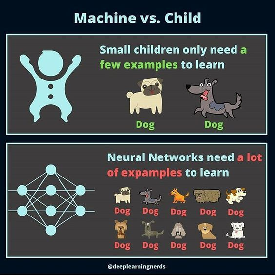

# Furniture Style Classifier
Final project for the Building AI course.

<!-- .......................................................................... TOC 
--->

___

## Summary

_This documentation is a collection of my general interest towards building a furniture style classifier, a general introduction to Neural Networks, their general architecture, their historical evolution including the MNIST dataset (1994), LeNet NN architecture (1998), the backpropagation algorithm by Hinton et al (1983), and the more recent advacements in the field: AlexNet NN architecture (2012) designed by Alex Krizhevsky in collaboration with Ilya Sutskever and Geoffrey Hinton; and the CIFAR-10 database (2009) collected by Alex Krizhevsky, Vinod Nair, and Geoffrey Hinton; and the ImageNet database (2006) by Fei-Fei Li. Further some key aspects of a Convolutional Neural Network (CNN) are also studied. In the process, I also researched the internet to look for various useful resources to understand the subject in more detail. During the process i also found out about machine learning libraries built to speedup building NN and CNN: Keras, Tensorflow, and PyTorch, and also some visual platforms such as Worlfram Mathematica, which offer an interesting way of visual building blocks. Further some opensource datasets and more specific furtniture classifier projects are also listed in the study. The research also looks into the aspect of Copyrights in the light of emerging AI technologies. The document concludes by listing some limitations of CNNs and a look into ways of deploying CNNs as mobile phone apps._

_A break-down of this document can be seen in the "Table of Contents" section below._

 
 <i> <b> Table of Contents </b> </i> 

 
The "Furniture Sytle Classifier" project is documented as a self-initiated knowledge reearch around the topic of image-based CNNs. The documentation is compiled in snippets over the course of two months, evolving into the current format. Each "Section" is supported with a "Literature Review" which delves deep into the relevant topic. 
     

| | Section     | Description |
|---| :----------- | :----------- |
|A | [Story & Motivation](https://github.com/gasingh/furniture-style-classifier/edit/main/README.md#story-and-motivation)      | _My personal story & how I got intrigued!_       |
|B | [Project Aim](https://github.com/gasingh/furniture-style-classifier/edit/main/README.md#aim-of-the-project)   | _Formal project direction_       |
|C | [How is it used?](https://github.com/gasingh/furniture-style-classifier/edit/main/README.md#how-is-it-used)  | _Uses of the AI tool_        |
|D | [AI methods: Skills, Knowledge Acquisition and Learning](https://github.com/gasingh/furniture-style-classifier/edit/main/README.md#ai-methods-skills-knowledge-acquisition-and-learning)| _Learning Section: how I can accomplish this endeavour_   |
| | | | 
| | _Literature Review 01: Understanding CNNs_ | | 
| | _Literature Review 02: CNN Classification & Logic_ | | 
| | _Literature Review 03: CNN Code Samples and Mathematics Explained_ | | 
| | _Literature Review 04: CNN Details and various mathematical data extraction layers of the algorithm_ | |
| | _Literature Review 05 EXTRAs: Historical Overview_ | | 
| | | _Literature Review 05.1_EXTRAs: CNN Explainer & 2d Convolutions_ | 
| | | _Literature Review 05.2_EXTRAs: Google Photos using CNNs & the ImageNet Competition and Paper by Google Research - 2012_ | 
| | | _Literature Review 05.3_EXTRAs: An Excellent Paper on understanding the mathematics of a CNN - National Key Lab of Novel Software Technology, China - 2017_ | 
| | | _Literature Review 05.4_EXTRAs: HISTORY MODULE: AlexNet and ImageNet: The Birth of Deep Learning - 2006_ |
| | | | 
|E | [Frameworks](https://github.com/gasingh/furniture-style-classifier/edit/main/README.md#frameworks)   | _Research into relevant training, courses, and framework documentations & intros_    |
| | _Learning Resources for PyTorch & Basic Machine Learning!_ | | 
| | | _SECTION 1: Here a collection of nice links for learning PyTorch!_ |
| | | _SECTION 2: Here are some links for Deep Learning!!_ | 
| | | _SECTION 3: Here are some links for 3D Deep Learning!!_ | 
| | | _SECTION 4: Object Recognition in Images_ | 
|F | [Data sources: AI training datasets (digital)](https://github.com/gasingh/furniture-style-classifier/edit/main/README.md#data-sources-ai-training-datasets-digital)   | _AI Training Sets available Online_        |
| | _Literature Review 06: AI Training Datasets Online_ | | 
|G | [Data sources: Stylization references (analog)](https://github.com/gasingh/furniture-style-classifier/edit/main/README.md#data-sources-stylization-references-analog) | Text        |
| | _Literature Review 07: Stylization References_ | |  
|H | [AI & Ethics](https://github.com/gasingh/furniture-style-classifier/edit/main/README.md#ai--ethics)   | _I investigated the sensetivity around the use of copyrighted data for training AIs such as CNNs_  |
| | _Literature Review 08: AI and Ethics around use of images for training AI models_ | | 
|I | [Limitations](https://github.com/gasingh/furniture-style-classifier/edit/main/README.md#limitations)   | _Limitations of CNNs_        |
|J | [What Next](https://github.com/gasingh/furniture-style-classifier/edit/main/README.md#what-next) | _future direction potential_ |
| | _Literature Review 09: Deploying an AI Application on a Mobile Phone_ | |
| | _Literature Review 10: Generative AI Frameworks_ | |

___

## Story and Motivation
The idea for the project emerged during a walk in London, during a weekend in October 2024.

I was wandering around in the streets of London, and stumbled across a book outside a bookshop in a sale. It was a pictorial guide from the 1990s teaching people how to identify furniture styles. The book is meant as a concise resource for curators, furniture collectors, and connoisseurs, as well as students of history and decorative arts. The book provide one page descriptions and images for 36 styles ranging from 1600s to 1900s. Almost instantly, I was fascinated by the idea that if a person can be trained to read a book and learn to identify furniture styles, can an AI do it as well? 

     

      

(_above 5 Photographs taken by the author_).

## Aim of the Project

The project is meant to provide an AI trained eye for furniture collectors, which can predict the best/ nearest possible visual style match for a piece of furniture! The project is inspired by a book which teaches people how to identify furniture types by understanding characteristic portions of a furniture type and attribute them to specific historical furniture styles. So the aim of the project is to learn the appropriate AI means to help find a solution that matches the way humans understand, perceive and identify images, and stylizations! 

<!-- Learn how to translate a visual guide into a textual reference for a computer program (probably a database?)
* The book has images with portions of furniture objects tagged and named, so they become clearly identifiable to the viewer. How can a set of images and related textual data/ labels be associated in a digital format, without too much manual processing? Maybe some kind of an image-OCR solution could help? Or another mini AI that can read a scan of a page, and make sense of it? -->  

## How is it used?

The idea will be to be able to send a picture to the application online onto a website, and the AI application should provide you the nearest match to the provided furniture image, and tell you why it showed you what it showed you. It should be able to label the various elements of an image based on learning typical visual features of a furniture style from an era. 

<!--
## Future Development

In the future, the developed AI tool should able to read descriptive page scans about furniture classification and typology texts and learn from it:

## Challenges

Limitations: The project doesnot look to solve 
Ethical Considerations: Ethically any images which are still in copyright should be utilized only after procuring permissions/  a solution like this? -->

## AI methods: Skills, Knowledge Acquisition and Learning
_What kind of skills, what kind of assistance would I need to move on?_

I would need to learn how to classify images using a **CNN**. I have learned that these are the kind of neural networks which can be trained to classify images. 
Below are two images illustraing the intent of the exercise. The first image below illustrates a Convolutional Neural Network Algorithm for identifying a piece of furniture, and the second image illustrates how a machine learning approach differs from a traditional human expert centered workflow in identification of visual styles. 

 
 <b> <i> THE PREMISE: An AI (Machine Learning Model) instead of a "Trained" Human Expert </i> </b> 
  
  
   
  
  a1. The theorerical premise: an AI system vs a human expert teaching a system to classify  
  <kbd>  </kbd>  
  [Source](https://www.shutterstock.com/image-vector/machine-vs-human-difference-between-robot-2121658835)  
  
  a2. Interpretations of an AI versus a Human towards world perception  
  <kbd>  </kbd>    
  [Source](https://www.researchgate.net/figure/Research-overview-deep-learning-based-interior-design-style-detection-for-design_fig1_346281080) 

 
 <b> <i> THE GENERAL ARCHITECTURE OF A NEURAL NETWORK TO CLASSIFY IMAGES </i> </b> 
  
 
   
  
  b. CNN to identify Cars!  
  <kbd>  </kbd>   
  [Source: Convolutional Neural Network on a structured bank customer data | by Carson Yan | Towards Data Science](https://towardsdatascience.com/convolutional-neural-network-on-a-structured-bank-customer-data-358e6b8aa759)  

  c. CNN to identify Cats!  
  <kbd>  </kbd>  
  [Source: ML Practicum: Image Classification  |  Machine Learning  |  Google for Developers](https://developers.google.com/machine-learning/practica/image-classification/convolutional-neural-networks)  

  <mark> d. CNN to identify a Chair! </mark>  
  <kbd>  </kbd>  
  [Source: How to Improve the Efficiency of Training Neural Networks 2 times](https://jaydevs.com/how-to-improve-the-efficiency-of-training-neural-networks/)  

  e. CNN to identify Fruits!  
  <kbd>  </kbd>  
  [Source: Fruit Classification using GoogleNet Convolutional Neural Network (CNN) - YouTube](https://www.youtube.com/watch?v=58-1KmsIEcQ)  

  f. CNN to identify Digits (MNIST)!  
  <kbd>  </kbd>  
  [Source: Basic Introduction to Convolutional Neural Network in Deep Learning](https://www.analyticsvidhya.com/blog/2022/03/basic-introduction-to-convolutional-neural-network-in-deep-learning/)  

  g. CNN to identify Digits (MNIST)!  
  <kbd>  </kbd>  
  [Source: CNN with MNIST dataset | Chan`s Jupyter](https://goodboychan.github.io/python/deep_learning/tensorflow-keras/2020/10/10/01-CNN-with-MNIST.html)  

  h. CNN to identify a Zebra!  
  <kbd>  </kbd>  
  [Source: What is CNN? | LinkedIn](https://www.linkedin.com/pulse/what-cnn-logesh-s-nxhfc/)

  i. CNN to identify Tweety!  
 <kbd>  </kbd>  
 [Source: Convolution Neural Networks :Guide for your first CNN Project using Pytorch :) | by Kritika Banerjee | Medium](https://medium.com/@kritiikaaa/convolution-neural-networks-guide-for-your-first-cnn-project-7ea56f7f6960) | [Source: PyTorch 卷积神经网络 | 菜鸟教程](https://www.runoob.com/pytorch/pytorch-cnn.html) | [A comprehensive guide on machine learning solutions: CNN, RNN and ANN](https://www.softwebsolutions.com/resources/difference-between-cnn-rnn-ann.html)

  j. Generic Architecture of a Neural Network (NN)  
  <kbd>  </kbd>  
  [Source: 1-s2.0-S0959652621032613-gr6.jpg (580×271)](https://ars.els-cdn.com/content/image/1-s2.0-S0959652621032613-gr6.jpg) | [Source: Deep Neural Network - an overview | ScienceDirect Topics](https://www.sciencedirect.com/topics/engineering/deep-neural-network) | [Source: A review on emerging artificial intelligence (AI) techniques for air pollution forecasting: Fundamentals, application and performance - ScienceDirect](https://www.sciencedirect.com/science/article/abs/pii/S0959652621032613)

  k. Generic Architecture of a Convolutional Neural Network (CNN)  
 <kbd>  </kbd>  
  [Source: Using Deep Learning Models / Convolutional Neural Networks](https://docs.ecognition.com/eCognition_documentation/User%20Guide%20Developer/8%20Classification%20-%20Deep%20Learning.htm)

 L. Another Architecture Diagram of a CNN  
 <kbd>  </kbd>  
 <kbd>  </kbd>  
  [Source: Convolutional Neural Network(CNN) with Practical Implementation | by Amir Ali | Aorb Tech | Medium](https://medium.com/machine-learning-researcher/convlutional-neural-network-cnn-2fc4faa7bb63)

 m. Yet another architecture diagram for a CNN, also showing integrations into devices and larger frameworks  
 <kbd>  </kbd>  
[Source: Image Classification using CNN : Python Implementation - Analytics Vidhya](https://www.analyticsvidhya.com/blog/2021/06/image-classification-using-convolutional-neural-network-with-python/)

 n. What is a convolution in a CNN?  
 <kbd>  </kbd>  
[Source: But what is a convolution? - YouTube | 3Blue1Brown](https://www.youtube.com/watch?v=KuXjwB4LzSA)

 o. What is Convolution?  
 <kbd>  </kbd>  
[Source: Overview of Convolutional Neural Network in Image Classification](https://analyticsindiamag.com/ai-mysteries/convolutional-neural-network-image-classification-overview/)

 p. Various uses of a CNN  
 <kbd>  </kbd>  
 [Source: Medical Image Analysis With Deep Neural Networks - ScienceDirect](https://www.sciencedirect.com/science/article/abs/pii/B9780128167182000129)

 Q. The Convolutional Neural Network - Theory and Implementation of LeNet-5 and AlexNet
 <kbd>  </kbd>  
 _IMG: Figure 3: LeNet-5 Architecture_  
 [Source: The Convolutional Neural Network - Theory and Implementation of LeNet-5 and AlexNet](https://pabloinsente.github.io/the-convolutional-network)  
 [Source-IMG: LeNet.png (2480×1163)](https://pabloinsente.github.io/assets/post-8/LeNet.png) | [Source-IMG: convolution.png (1665×2079)](https://pabloinsente.github.io/assets/post-8/convolution.png) | [Source-IMG: pixelated.png (602×378)](https://pabloinsente.github.io/assets/post-8/pixelated.png) | [Source-IMG: pooling.png (1341×632)](https://pabloinsente.github.io/assets/post-8/pooling.png)

   * **LeCun’s LeNet**
     * The architecture today known as the convolutional neural network was introduced by [Yann LeCun](https://yann.lecun.com/) in 1989. Although LeCun was trained as an Electrical Engineer, he got interested in the idea of building intelligent machines from early on in his undergraduate education by reading a book about the Piaget vs Chomsky debate on language acquisition. In that book, several researchers argued in favor of or against each author’s view. Among those contributors was [Seymour Papert](https://en.wikipedia.org/wiki/Seymour_Papert) who mentioned Rosenblatt’s perceptron in his article, which inspired LeCun to learn about neural networks for the first time. Ironically, this was the same Seymour Papert that published [the book](https://en.wikipedia.org/wiki/Perceptrons_(book)) (along with Marvin Minsky) that brought the demise on the interest on neural networks in the late ’60s. I don’t believe in karma, but this certainly looks like it.
     * The perceptron's book: https://rodsmith.nz/wp-content/uploads/Minsky-and-Papert-Perceptrons.pdf
     * Eventually, LeCun became a postdoc at the University of Toronto with Geoffrey Hinton and started to prototype the first convolutional network. By the late ’80s, LeCun was working at [Bell Labs](https://en.wikipedia.org/wiki/Bell_Labs) in New Jersey, the place where he and his colleagues developed at published the first convolutional neural network trained with backpropagation, the “LeNet”, that could effectively recognize handwritten zip codes from US post office. This early convolutional network went through several rounds of modifications and improvements (LeNet-1, LeNet-2, etc.) until in 1998 the [LeNet-5](https://yann.lecun.com/exdb/lenet/) reached test error rates of 0.95% (99.05 of classification accuracy) in the [MNIST dataset of handwritten digits](https://yann.lecun.com/exdb/mnist/).
     * 
   * **The convolution opertion: feature detection**
     * The general architecture of the LeNet-5 is shown in Figure 3. The input layer L−0 acts like the retina receiving images of characters that are centered and size-normalized (otherwise, some images may not fit in the input layer). The next layer L−1 is composed of several features maps, which have the same role that the Neocognitron simple-cells: to extract simple features as oriented edges, corners, end-points, etc. In practice, a feature map is a squared matrix of identical weights. Weights within a feature map need to be identical so they can detect the same local feature in the input image. Weights between feature maps are different so they can detect different local features. Each unit in a feature map has a receptive field. This is, a small n×n sub-area or “neighborhood” of the input image that can be “perceived” by a unit in the feature map.
    * Feature maps and receptive fields sound complicated. Here is a metaphor that may be helpful: imagine that you have 6 flashlights with a square beam of light. Each flashlight has the special quality of revealing certain “features” of images drawn with invisible ink, like corners or oriented edges. Also, imagine that you have a set of images that were drawn with invisible ink. Now, you need your special flashlights to reveal the hidden character in the image. What you need to do is to carefully illuminate each section of the invisible image, from right to left and top to bottom, with each of your 6 flashlights. Once you finish the process, you should be able to put together all the little “features” revealed by each flashlight to compose the full image shape. Here, the square beam of light sliding over each pixel represents the aforementioned receptive field, and each flashlight represents a feature map.
     * Figure 4 shows a simplified representation of the feature detection process (assuming that each time a pixel in the input image match a pixel in the feature detector we add a value of 1, although in practice it can be any real-valued scalar). In this example we use a stride of 1, meaning that we shift the receptive field by 1 pixel (to the right or down) for each cell in the feature map.
     * <kbd>  </kbd>  
     * _IMG: Figure 4: Feature detection (convolution)_  
     * The process of sliding over the image with the receptive field (sometimes called kernels) of feature maps equals to a mathematical operation called convolution (technically, equals to cross-correlation, more about this later), hence the name convolutional network. The full convolution operation involves repeating the process in Figure 4 for each feature map. If you are wondering how do you come up with appropriated features detectors, the answer is that you don’t need to: the feature maps weights are learned in the training process.
   * **The pooling operation: subsampling**
     * Once the convolution operation is done, what we have learned is whether a feature is present in the image or not. Now, knowing that a collection of features is present in an image won’t tell us, by itself, which image they correspond to. What we need to know is their approximate position relative to each other. For instance, if we know that we have a “curvy horizontal line” at the center-bottom, a “curvy vertical line” at the middle-right, a “straight vertical line” at upper-left, and a “straight horizontal line” at the center-top, we should be able to tell we have a “5”. This is even more important considering that real-life images like handwritten numbers have considerable variability in their shape. No two individuals write numbers in the exact same manner. Hence, we want our network to be as insensitive as possible to the absolute position of a feature, and as sensitive as possible to its relative position: handwritten 5s may look different, but the curvy part is almost always at the bottom and the straight part at the top. This is sometimes referred to as invariance to local translation. One way to accomplish this is by reducing the spatial resolution of the image. This is what sub-sampling or pooling does.
     * There are many ways to sub-sample an image. In the LeNet-5, this operation performs a local averaging of a section of the feature map, effectively reducing the resolution of the feature map as a whole, and the sensitivity of the network to shifts and distortions in the input image. A colloquial example is what happens when you “pixelate” an image like in Figure 5.
     * <kbd>  </kbd>  
     * _IMG: Figure 5: sub-sampling effect_   
     * A sub-sampling layer will have as many “pixelated” feature maps as “normal” feature maps in the convolutional layer. The mechanics of sub-sampling are as follows: again, we have n×n
   receptive field that “perceives” a section of the “normal” feature map and connect to a unit in the “pixelated” feature map. This time, there is no overlap between each “stride” of the receptive field: each unit is connected to a non-overlapping section of the original feature map. You can think about this as taking “strides” of a size equal to n, e.g., for a 3×3
   feature map, we take a stride of 3. Then, we take a weighted average of each pixel in the receptive field and pass the resulting sum through a sigmoid function (or any other non-linear function). The weights in the weighted average are also parameters that the network learns with training. Figure 6 shows this process for a single sub-sampled feature map.
     * <kbd>  </kbd>  
     * _IMG: Figure 6: Sub-sampling (pooling)_   
     * The result of sub-sampling is another grid of numbers (note that the numbers in Figure 6 are made up). We went from a 12×12 input image, to a 3×3 feature map after convolution and pooling (keep in mind that I intentionally reduced LeNet-5 original dimensions to simplify the examples). Since in our original example we had 6 features map, we need to repeat the process in Figure 6 6 times, one of each feature map.
     * The next convolution hidden layer S2 increases the number of feature maps compared to S1. If you were to add more sets of Sn and Cn hidden layers, you will repeat this alternating pattern again: as the spatial resolution is reduced (by pooling), the number of feature maps in the next layer is increased. The idea here is to compensate for the reduction in spatial resolution by increasing the richness of the learned representations (i.e., more feature maps).
     * Once we are done with the sequence of convolution and pooling, the network implements a traditional fully-connected layer as in the multi-layer perceptron. The first fully-connected F1 layer has the role of “flattening” the C2 pooling layer. Remember that fully-connected layers take an input vector, and the dimensions of the LeNet-5 C2 layer are a 5×5×16 tensor, this is, sixteen 5 by 5 feature maps. The dimensionality of the first fully-connected layer is 120, which is the result of another convolution. The next hidden layer F2 “compress” the output even further into a vector of size 84. Finally, we have the output-layer implementing a euclidean radial basal function (RBD) with 10 neurons to perform the classification of numbers (0-9).

R. **Concepts and Terminologies used in CNNs**  
<kbd>  </kbd>  
* [Convolutional Neural Networks (CNNs): An Introduction | LinkedIn](https://www.linkedin.com/pulse/convolutional-neural-networks-cnns-introduction-ali-mahdavi/)
* [Convolution in NN. How you convolve in CNN? | by Akhil Soni | Medium](https://medium.com/@akhil0435/convolution-in-nn-7845eb040e77)
* [Flattening CNN layers for Neural Network and basic concepts | by Muhammad Shoaib Ali | Medium](https://medium.com/@muhammadshoaibali/flattening-cnn-layers-for-neural-network-694a232eda6a)
* 02:09 19/12/2024

_Below are 4 primary sections which assimilate some visual and textual searches and some preliminary research conducted on the subject. This should serve as a ready reference for me to start working on my project further._

 
 Literature Review 01: Understanding CNNs 
  

   **Google Search 01**: _cnn image classification diagram_
   [cnn image classification diagram - Google Search](https://www.google.com/search?sca_esv=81b62b241f3359c7&rlz=1C1GCEB_enGB1045GB1045&sxsrf=ADLYWIJA4sPq0NGHOn2zctn4R8i_ehBPTQ:1728608543687&q=cnn+image+classification+diagram&udm=2&fbs=AEQNm0Aa4sjWe7Rqy32pFwRj0UkWd8nbOJfsBGGB5IQQO6L3J_86uWOeqwdnV0yaSF-x2jon2iao6KWCaVjfn7ahz_sfz4kQc-hbvsXJ2gNx0RnV2nl305mvoek0YK94ylYY2a4b3Q-OEwW5lKppi2wujywZWmdIJVp8wrsv_g-eh5sWEDXx8JNpgmjsiKj2mZMvftPlZJZz&sa=X&ved=2ahUKEwjR3M7RkIWJAxUo3wIHHRD1KZMQtKgLegQIDhAB&biw=1383&bih=747&dpr=2.5#vhid=H2hl3BjvD5pswM&vssid=mosaic)  
   
  * **i. Understanding CNNs for Image Classification**
       
  
    [Understanding Convolutional Neural Networks (CNNs): Best For Image Classification](https://www.linkedin.com/pulse/understanding-convolutional-neural-networks-cnns-best-al-ameen/)
  
  * **ii. Basic Convolutional Network Architecture Explained**
       
  
    [A High-Accuracy Model Average Ensemble of Convolutional Neural Networks for Classification of Cloud Image Patches on Small Datasets](https://www.researchgate.net/publication/336805909_A_High-Accuracy_Model_Average_Ensemble_of_Convolutional_Neural_Networks_for_Classification_of_Cloud_Image_Patches_on_Small_Datasets)
  
  * **iii. Image Recognition with CNNs**
       
 
    CNNs are a type of deep learning algorithm that are particularly good at recognizing patterns and objects in images. With the right training and enough data, CNNs can even outperform humans in tasks like image recognition. So grab your favorite caffeinated beverage, put on your learning cap, and let’s dive into the world of CNNs!
    
    Convolutional neural networks, or CNNs, are a type of deep learning algorithm that is widely used in computer vision tasks. CNNs are specifically designed to process data that has a grid-like structure, such as images, and are capable of automatically learning and extracting features from this data. This allows CNNs to perform tasks such as image classification and object detection with high accuracy.
    
    Convolutional neural networks (CNNs) are commonly used for image recognition and other tasks that involve visual data. For example, you could use a CNN to classify images of different types of animals. To do this, you would first need to create a dataset of images of animals, with labels indicating the type of animal in each image (e.g. cat, dog, horse, etc.).
    
    To train the CNN, you would feed the dataset into the model and use an optimization algorithm to adjust the weights of the network so that it can accurately classify the images. Once the model is trained, you can use it to make predictions on new images. For example, you could feed an image of a cat into the model and it would predict that the image contains a cat.
    
    The key advantage of using a CNN for this task is that it can automatically learn the features that are important for distinguishing between different types of animals. This means that you don’t need to manually design features to use as inputs to the model — the CNN will learn these features automatically from the data. This makes CNNs very effective for tasks that involve visual data.
 
    The formula for a convolutional neural network (CNN) involves several components, including the input layer, convolutional layers, pooling layers, and fully connected layers.
    
    The input layer receives the raw data, such as an image or audio signal. The convolutional layers apply filters to the input data, extracting important features and reducing the dimensionality. The pooling layers then downsample the feature maps, reducing the spatial dimensions while retaining the most important information.
    
    Finally, the fully connected layers use the extracted features to make predictions or perform other tasks, such as classification or regression. The output of the CNN is determined by the specific goals of the model and the design of the network architecture.
        
    [Img Source](https://miro.medium.com/v2/resize:fit:4800/format:webp/1*S6fxo5MZG-Jy2DwAbxC8xQ.jpeg)
    [Image recognition with CNNs: improving accuracy and efficiency | by Mitch Huang | Medium](https://medium.com/@mitchhuang777/image-recognition-with-cnns-improving-accuracy-and-efficiency-dd347b636e0c)
  
  * **iv. Deep CNN for Image Recognition**
       
  
    [Hierarchical Deep CNN for Image Recognition | LinkedIn](https://www.linkedin.com/pulse/hierarchical-deep-cnn-image-recognition-satya-vasanth-reddy-tumati/)
  
  * **v. CNN Architecture Illustrated**
       
  
    The typical CNN architecture for image-classification tasks. a The typical CNN architecture for image classification tasks consists of the input layer, convolutional layers, fully connected layers, and output prediction. b Convolution operation. c Pooling operation.

      
    
    Three deep-learning-based upsampling methods typically used in CNN. a Unpooling. b Transposed convolution. c Sub pixel convolution.

    [Img Source 1](https://www.researchgate.net/figure/The-typical-CNN-architecture-for-image-classification-tasks-a-The-typical-CNN_fig2_358833373)
,[Img Source 2](https://www.researchgate.net/figure/Three-deep-learning-based-upsampling-methods-typically-used-in-CNN-a-Unpooling-b_fig4_358833373)
  
    [(PDF) Deep learning in optical metrology: a review](https://www.researchgate.net/publication/358833373_Deep_learning_in_optical_metrology_a_review)

 

 
 Literature Review 02: CNN Classification & Logic 
  

    **Google Search 02** : _cnn image classification logic explained_
   [cnn image classification logic explained - Google Search](https://www.google.com/search?sca_esv=0ddce2aac02c1925&rlz=1C1GCEB_enGB1045GB1045&sxsrf=ADLYWIL7FDPMsDphMXEHum_LcnsV1SZhfQ:1728830101591&q=cnn+image+classification+logic+explained&udm=2&fbs=AEQNm0Aa4sjWe7Rqy32pFwRj0UkWfbQph1uib-VfD_izZO2Y5sC3UdQE5x8XNnxUO1qJLaQWdrk7tnb4cmEQUUbePQeEPt1o3RbA2PBoOOMJ3T4YmNHjUWP9fTrmSj74dymHzutB84oF5TSmO6C32fnEW8r36y461mhVKj_KdcRWfsjRkNsZzVwY13qpaW5CEVFIaryiYRoM&sa=X&ved=2ahUKEwjcg9SAyouJAxVQUUEAHcgGKI4QtKgLegQIEBAB&biw=1383&bih=747&dpr=2.5)  

  * **i. Review of deep learning: concepts, CNN architectures, challenges, applications, future directions | SpringerOpen 2021**
 
    In the last few years, the deep learning (DL) computing paradigm has been deemed the Gold Standard in the machine learning (ML) community. Moreover, it has gradually become the most widely used computational approach in the field of ML, thus achieving outstanding results on several complex cognitive tasks, matching or even beating those provided by human performance. One of the benefits of DL is the ability to learn massive amounts of data. The DL field has grown fast in the last few years and it has been extensively used to successfully address a wide range of traditional applications. More importantly, DL has outperformed well-known ML techniques in many domains, e.g., cybersecurity, natural language processing, bioinformatics, robotics and control, and medical information processing, among many others. Despite it has been contributed several works reviewing the State-of-the-Art on DL, all of them only tackled one aspect of the DL, which leads to an overall lack of knowledge about it. Therefore, in this contribution, we propose using a more holistic approach in order to provide a more suitable starting point from which to develop a full understanding of DL. Specifically, this review attempts to provide a more comprehensive survey of the most important aspects of DL and including those enhancements recently added to the field. In particular, this paper outlines the importance of DL, presents the types of DL techniques and networks. It then presents convolutional neural networks (CNNs) which the most utilized DL network type and describes the development of CNNs architectures together with their main features, e.g., starting with the AlexNet network and closing with the High-Resolution network (HR.Net). Finally, we further present the challenges and suggested solutions to help researchers understand the existing research gaps. It is followed by a list of the major DL applications. Computational tools including FPGA, GPU, and CPU are summarized along with a description of their influence on DL. The paper ends with the evolution matrix, benchmark datasets, and summary and conclusion.

           
    The difference between deep learning and traditional machine learning

    Achieving the classification task using conventional ML techniques requires several sequential steps, specifically pre-processing, feature extraction, wise feature selection, learning, and classification. Furthermore, feature selection has a great impact on the performance of ML techniques. Biased feature selection may lead to incorrect discrimination between classes. Conversely, DL has the ability to automate the learning of feature sets for several tasks, unlike conventional ML methods [18, 26]. DL enables learning and classification to be achieved in a single shot (Fig. 3: Figure above). 

       
    Deep learning performance compared to human

     DL has become an incredibly popular type of ML algorithm in recent years due to the huge growth and evolution of the field of big data [27, 28]. It is still in continuous development regarding novel performance for several ML tasks [22, 29,30,31] and has simplified the improvement of many learning fields [32, 33], such as image super-resolution [34], object detection [35, 36], and image recognition [30, 37]. Recently, DL performance has come to exceed human performance on tasks such as image classification (Fig. 4: Figure above).

       
    An example of CNN architecture for image classification

    In the field of DL, the CNN is the most famous and commonly employed algorithm [30, 71,72,73,74,75]. The main benefit of CNN compared to its predecessors is that it automatically identifies the relevant features without any human supervision [76]. CNNs have been extensively applied in a range of different fields, including computer vision [77], speech processing [78], Face Recognition [79], etc. The structure of CNNs was inspired by neurons in human and animal brains, similar to a conventional neural network. More specifically, in a cat’s brain, a complex sequence of cells forms the visual cortex; this sequence is simulated by the CNN [80]. Goodfellow et al. [28] identified three key benefits of the CNN: equivalent representations, sparse interactions, and parameter sharing. Unlike conventional fully connected (FC) networks, shared weights and local connections in the CNN are employed to make full use of 2D input-data structures like image signals. This operation utilizes an extremely small number of parameters, which both simplifies the training process and speeds up the network. This is the same as in the visual cortex cells. Notably, only small regions of a scene are sensed by these cells rather than the whole scene (i.e., these cells spatially extract the local correlation available in the input, like local filters over the input).
    
    A commonly used type of CNN, which is similar to the multi-layer perceptron (MLP), consists of numerous convolution layers preceding sub-sampling (pooling) layers, while the ending layers are FC layers. An example of CNN architecture for image classification is illustrated in Fig. 7.
    
    [Review of deep learning: concepts, CNN architectures, challenges, applications, future directions | Journal of Big Data | Full Text](https://journalofbigdata.springeropen.com/articles/10.1186/s40537-021-00444-8)
    
  * **ii. Math behind CNNs**
     
      
    [Understanding CNN for Image Processing | Svitla Systems](https://svitla.com/blog/cnn-for-image-processing/)  
    [Math Behind CNNs for Image Processing | Svitla Systems](https://svitla.com/blog/math-at-the-heart-of-cnn/)  
  
  * **iii. Face Recognition using CNNs**
       
    [Face Recognition using CNN (GoogleNet) - YouTube](https://www.youtube.com/watch?app=desktop&v=rv_RctF10DY)

 
 Literature Review 03: CNN Code Samples and Mathematics Explained 
  

    **Google Search 03** : _cnn image classification logic explained_

  * **i. Image Similarity using Cosine Distance** 
       
    [Image Similarity using CNN feature embeddings | by fareid | Medium](https://medium.com/@f.a.reid/image-similarity-using-feature-embeddings-357dc01514f8)  
    Code Reference for an Image2Vec Class: 
    [ImageSimilarity/src/ImgSim/image_similarity.py at main · totogot/ImageSimilarity](https://github.com/totogot/ImageSimilarity/blob/main/src/ImgSim/image_similarity.py)
  
  * **ii. MNIST DataSet identification using a CNN**
        
    [Image Classification Using CNN](https://www.analyticsvidhya.com/blog/2020/02/learn-image-classification-cnn-convolutional-neural-networks-3-datasets/)

  * **iii. Introduction to Deep Learning | Mathworks UK** 
        
    [What Are Convolutional Neural Networks? | Introduction to Deep Learning - MATLAB](https://uk.mathworks.com/videos/introduction-to-deep-learning-what-are-convolutional-neural-networks--1489512765771.html?gclid=CjwKCAjw9p24BhB_EiwA8ID5BgM-Z1P_irHJVX-sgf7yURAMJa6FLDN24UporL4_hAPeeRACNPGdZBoCvqMQAvD_BwE&ef_id=CjwKCAjw9p24BhB_EiwA8ID5BgM-Z1P_irHJVX-sgf7yURAMJa6FLDN24UporL4_hAPeeRACNPGdZBoCvqMQAvD_BwE:G:s&s_kwcid=AL!8664!3!604136203113!b!!g!!%2Bconvolutional%20%2Bneural%20%2Bnetworks&s_eid=psn_52858618944&q=+convolutional++neural++networks&gad_source=1)
  
  * **iv. What is a Convolutional Neural Network? | Mathworks UK**
       
    Example of a network with many convolutional layers. Filters are applied to each training image at different resolutions, and the output of each convolved image is used as the input to the next layer.  
    [What Is a Convolutional Neural Network? | 3 things you need to know - MATLAB & Simulink](https://uk.mathworks.com/discovery/convolutional-neural-network.html)
  
  * **v. Understanding of the CNN Matrix Math | Miro: Raghav Prabhu**
       
    Consider a 5 x 5 whose image pixel values are 0, 1 and filter matrix 3 x 3
       
    Then the convolution of 5 x 5 image matrix multiplies with 3 x 3 filter matrix which is called “Feature Map” as output. Annotated above as the Convolved Feature.
       
    Convolution of an image with different filters can perform operations such as edge detection, blur and sharpen by applying filters. The below example shows various convolution image after applying different types of filters (Kernels).  
       
    Summary
        - Provide input image into convolution layer
        - Choose parameters, apply filters with strides, padding if requires. Perform convolution on the image and apply ReLU activation to the matrix.
        - Perform pooling to reduce dimensionality size
        - Add as many convolutional layers until satisfied
        - Flatten the output and feed into a fully connected layer (FC Layer)
        - Output the class using an activation function (Logistic Regression with cost functions) and classifies images.
     
    [Understanding of Convolutional Neural Network (CNN) — Deep Learning | by Prabhu Raghav | Medium](https://medium.com/@RaghavPrabhu/understanding-of-convolutional-neural-network-cnn-deep-learning-99760835f148)  

  * **vi. CNN Architectures | Miro: Raghav Prabhu**
       
    [CNN Architectures — LeNet, AlexNet, VGG, GoogLeNet and ResNet | by Prabhu Raghav | Medium](https://medium.com/@RaghavPrabhu/cnn-architectures-lenet-alexnet-vgg-googlenet-and-resnet-7c81c017b848)  

 
 Literature Review 04: CNN Details and various mathematical data extraction layers of the algorithm 
  

  **Google Search 04** : _pooling to reduce dimensions in CNN_
   [pooling to reduce dimensions in CNN - Google Search](https://www.google.com/search?sca_esv=778fd8ccaca240ed&rlz=1C1GCEB_enGB1045GB1045&sxsrf=ADLYWILPtdUmBQRzcTnLjhp_uTU-VzsQLg:1728858943390&q=pooling+to+reduce+dimensions+in+CNN&udm=2&fbs=AEQNm0Aa4sjWe7Rqy32pFwRj0UkWd8nbOJfsBGGB5IQQO6L3J_86uWOeqwdnV0yaSF-x2jon2iao6KWCaVjfn7ahz_sfz4kQc-hbvsXJ2gNx0RnV2nl305mvoek0YK94ylYY2a4b3Q-OEwW5lKppi2wujywZWmdIJVp8wrsv_g-eh5sWEDXx8JNpgmjsiKj2mZMvftPlZJZz&sa=X&ved=2ahUKEwik5L-5tYyJAxWq8LsIHd6UFVkQtKgLegQIFBAB&biw=1383&bih=747&dpr=2.5#vhid=BGrXRMr3gYeZXM&vssid=mosaic)  
  
  * **i. Convolutional Neural Network: A Complete Guide | OpenCV | PyTorch** 
       
       
     
    OpenCV University has CNN tutorials in PyTorch. This is great!
      
    Convolutional Neural Network (CNN) forms the basis of computer vision and image processing. In this post, we will learn about Convolutional Neural Networks in the context of an image classification problem. We first cover the basic structure of CNNs and then go into the detailed operations of the various layer types commonly used. The above diagram shows the network architecture of a well-known CNN called VGG-16 for illustration purposes. It also shows the general structure of a CNN, which typically includes a series of convolutional blocks followed by a number of fully connected layers.
      
    The convolutional blocks extract meaningful features from the input image, passing through the fully connected layers for the classification task.    
    [Convolutional Neural Network: A Complete Guide](https://learnopencv.com/understanding-convolutional-neural-networks-cnn/)
         
  * <mark>**ii. Guide to CNNs | Saturn Cloud**</mark>
       
    A CNN sequence to classify handwritten digits    
    A Convolutional Neural Network (ConvNet/CNN) is a Deep Learning algorithm that can take in an input image, assign importance (learnable weights and biases) to various aspects/objects in the image, and be able to differentiate one from the other. The pre-processing required in a ConvNet is much lower as compared to other classification algorithms. While in primitive methods filters are hand-engineered, with enough training, ConvNets have the ability to learn these filters/characteristics.
      
    The architecture of a ConvNet is analogous to that of the connectivity pattern of Neurons in the Human Brain and was inspired by the organization of the Visual Cortex. Individual neurons respond to stimuli only in a restricted region of the visual field known as the Receptive Field. A collection of such fields overlap to cover the entire visual area.
      
    A ConvNet is able to successfully capture the Spatial and Temporal dependencies in an image through the application of relevant filters. The architecture performs a better fitting to the image dataset due to the reduction in the number of parameters involved and the reusability of weights. In other words, the network can be trained to understand the sophistication of the image better.    
        
    [A Guide to Convolutional Neural Networks — the ELI5 way | Saturn Cloud Blog](https://saturncloud.io/blog/a-comprehensive-guide-to-convolutional-neural-networks-the-eli5-way/)
    
  * <mark> **iii. A Comprehensive Guide: What are Convolutional Neural Networks | BasicAI's Blog** </mark>
       
    While browsing through images on social media or using facial recognition to unlock your smartphone, have you ever wondered what technology makes these seemingly simple everyday actions possible? Behind all this is the powerful technology of Convolutional Neural Networks (CNNs). CNNs are not only the cornerstone of modern computer vision but also a key driver in advancing artificial intelligence.  
     Applications of CNNs:   
    Image Recognition and Classification: This is the most traditional and widespread application of CNNs. They have shown exceptional performance in tasks like recognizing faces on social media and identifying abnormalities in medical imaging. For instance, Google Photos uses CNNs for image content recognition and classification, distinguishing thousands of objects and scenes with over 90% accuracy. In healthcare, CNNs are used for assisting diagnoses, such as identifying skin cancer, matching the accuracy of professional dermatologists.
      
    Object Detection and Segmentation: CNNs can not only recognize objects within images but also determine their location and size (object detection) and even precisely segment each object within an image (image segmentation). In autonomous vehicle technology, such as Tesla's Autopilot system, CNNs are used for real-time detection of vehicles, pedestrians, and various obstacles on the road, with an accuracy rate exceeding 95%. In retail, CNNs enhance efficiency and accuracy in object recognition and inventory management.    
    [A Comprehensive Guide: What are Convolutional Neural Networks | BasicAI's Blog](https://www.basic.ai/blog-post/a-comprehensive-guide-to-convolutional-neural-networks)
     
  * **iv. CNN Guide | Microsoft | PyTorch | CIFAR10 dataset**  
    
     Here, you'll build a basic convolution neural network (CNN) to classify the images from the CIFAR10 dataset.
     
    [Introduction to Computer Vision with PyTorch - Training | Microsoft Learn](https://learn.microsoft.com/en-us/training/modules/intro-computer-vision-pytorch/)
    [Use PyTorch to train your image classification model | Microsoft Learn](https://learn.microsoft.com/en-us/windows/ai/windows-ml/tutorials/pytorch-train-model)

  

  * vii.
    

[CNN in combination with KNN - Deep Learning - fast.ai Course Forums | Specific Algorithm tweak for Furniture Classification Tasks](https://forums.fast.ai/t/cnn-in-combination-with-knn/4280)

 
 <b> Literature Review 05: Historical Overview  </b> 

 
 <mark> Literature Review 05.1_EXTRAs: CNN Explainer & 2d Convolutions </mark> 

_**Super Useful Links from OpenCV CNN Webpage!!**_
  
  * <mark>**CNN Explainer**</mark>

      
    [**CNN Explainer**](https://poloclub.github.io/cnn-explainer/)  
    [**Demo Video "CNN Explainer: Learning Convolutional Neural Networks with Interactive Visualization" - YouTube**](https://www.youtube.com/watch?v=HnWIHWFbuUQ)
     
      
      
          
    [**Paper: 20-vis-cnnexplainer.pdf**](https://poloclub.github.io/papers/20-vis-cnnexplainer.pdf) 
    [**(Paper: LocalCopy: CNN Explainer)**](https://github.com/gasingh/furniture-style-classifier/blob/main/cnnExplainer_PAPER_20-vis-cnnexplainer.pdf)  
  
  * **2D Convolution Explained**
  
        
    [2D Convolution Explained: Fundamental Operation in Computer Vision - YouTube](https://www.youtube.com/watch?v=yb2tPt0QVPY)  
     
  
  * <mark>**6 basic things to know about Convolution | 2D Convolution explained by applying Convolution Matrices in Numpy**</mark> 
  
       
    Convolution Operation on a 7x7 matrix with a 3x3 kernel  
      * 1. In mathematics, convolution is an operation performed on two functions (f and g) to produce a third function. Convolution is one of the most important operations in signal and image processing. It could operate in 1D (e.g. speech processing), 2D (e.g. image processing) or 3D (video processing).  
      * 2. In image processing, convolution is the process of transforming an image by applying a kernel over each pixel and its local neighbors across the entire image. The kernel is a matrix of values whose size and values determine the transformation effect of the convolution process.  
      * 3. The Convolution Process involves these steps. (1)It places the Kernel Matrix over each pixel of the image (ensuring that the full Kernel is within the image), multiplies each value of the Kernel with the corresponding pixel it is over. (2)Then, sums the resulting multiplied values and returns the resulting value as the new value of the center pixel. (3) This process is repeated across the entire image.  
      * 4. As we see in the picture, a 3x3 kernel is convoluted over a 7x7 source image. Center Element of the kernel is placed over the source pixel. The source pixel is then replaced with a weighted sum of itself and surrounding pixels. The output is placed in the destination pixel value. In this example, at the first position, we have 0 in source pixel and 4 in the kernel. 4x0 is 0, then moving to the next pixel we have 0 and 0 in both places. 0x0 is 0. Then again 0x0 is 0. Next at the center there is 1 in the source image and 0 in the corresponding position of kernel. 0x1 is 0. Then again 0x1 is 0. Then 0x0 is 0 and 0x1 is 0 and at the last position it is -4x2 which is -8. Now summing up all these results we get -8 as the answer so the output of this convolution operation is -8. This result is updated in the Destination image.  
      * 5. The output of the convolution process changes with the changing kernel values.
          * IDENTITY KERNEL: For example, an Identity Kernel shown below, when applied to an image through convolution, will have no effect on the resulting image. Every pixel will retain its original value as shown in the following figure.  
           
          Identity Kernel  
            
          Original Image(Left) and Image after applying Identity Filter of size 3x3(Right)  
          * SHARPEN KERNEL: A Sharpen Kernel like this when applied to an image through convolution, will have an image sharpening effect to the resulting image. The precise values can be customized for varying levels of sharpness as shown in the following figure.  
             
          Sharpen Kernel  
            
          Original Image(Left) and Image after applying Sharpen Filter of size 3x3 (Right)  
          * GAUSSIAN BLUR KERNEL: The Gaussian Blur Kernel like this when applied to an image through convolution, will apply a Gaussian Blurring effect to the resulting image.
             
             
          Just as how the values of the Kernel can be varied for different levels of effects, the size of the Kernel can also be altered to shape the effect of the convolution.By increasing the size of the Kernel Matrix, the spatial locality influencing each pixel’s resulting value is increased as pixels from further away are being pulled into the equation. There are many more Kernels that are used in image processing such as edge detection, embossing, rotation, etc.  
      * 6. Convolution is the key concept in Convolutional Neural Networks. Convolutional Neural Networks (CNN) are a type of Deep Neural Network. A CNN comprises of Convolutional Layer, Pooling Layer, and Fully-Connected Layer. At the Convolution layer, a CNN applies convolution on to its inputs using a Kernel Matrix that it calibrates through training. For this reason, CNNs are very good at feature matching in images and object classification. The convolution layer parameters consist of a set of learnable kernels. Every kernel is small matrix that extends through the full depth of the input volume. During the forward pass, we convolve each kernel across the width and height of the input image and compute dot products between the pixel values of the source and kernel at corresponding positions.
       
    [6 basic things to know about Convolution | by Madhushree Basavarajaiah | Medium](https://medium.com/@bdhuma/6-basic-things-to-know-about-convolution-daef5e1bc411)  
    Numpy Code  
    [Convolution](https://gist.github.com/MadhushreeB/620a27aceb3088885546bc5b5a88245f#file-convolution-py)  
  * <mark>**What Is a Convolution? How To Teach Machines To See Images** </mark>
        
    [Image Classification: An Introduction to Artificial Intelligence | 8th Light](https://8thlight.com/insights/image-classification-an-introduction-to-artificial-intelligence)
    [What Is a Convolution? How To Teach Machines To See Images | 8th Light](https://8thlight.com/insights/what-is-a-convolution-how-to-teach-machines-to-see-images)
  * **Above 4 links based on a subsequent Google Search** : _2D Convolution Explained: Fundamental Operation in Computer Vision_
    [2D Convolution Explained: Fundamental Operation in Computer Vision - Google Search](https://www.google.com/search?sca_esv=778fd8ccaca240ed&rlz=1C1GCEB_enGB1045GB1045&sxsrf=ADLYWIJxNef7cUzatRZ3gqBHF2ASFG3p6w:1728862557474&q=2D+Convolution+Explained:+Fundamental+Operation+in+Computer+Vision&udm=2&fbs=AEQNm0Aa4sjWe7Rqy32pFwRj0UkWfbQph1uib-VfD_izZO2Y5sC3UdQE5x8XNnxUO1qJLaTV4c8WUZIVpqotNJgZT-nG6tsHwc3BxYJ7SJsoRXGGNwEIXpA7OZG7ZaHhjSESTEISdWI9c-9iMZIuDuLLcLeXPAcrvS050xiLHdT_XEfYYSw3K4Imoc20bsa6YY0FtgSBNRMi&sa=X&ved=2ahUKEwjg9-n0woyJAxVZnf0HHWJiAGIQtKgLegQIDRAB&biw=1383&bih=747&dpr=2.5#vhid=cr7CSy_DCtOU5M&vssid=mosaic)
  * 01:02 14/10/2024

 
 <mark>  Literature Review 05.2_EXTRAs: Google Photos using CNNs & the ImageNet Competition and Paper by Google Research | 2012 </mark> 

_**Excellent Articles**_

* **A Comprehensive Guide: What are Convolutional Neural Networks | BasicAI's Blog**

     
    
    [A Comprehensive Guide: What are Convolutional Neural Networks | BasicAI's Blog](https://www.basic.ai/blog-post/a-comprehensive-guide-to-convolutional-neural-networks)

* **Revolutionizing Vision: The Rise and Impact of Image Recognition Technology | BasicAI's Blog**

     
       
    
    [Revolutionizing Vision: The Rise and Impact of Image Recognition Technology | BasicAI's Blog](https://www.basic.ai/blog-post/image-recognition)

* **CNN Algorithm used in Google Photos | Reference Google Research Blog & ImageNet Paper at University of Toronto**

     
     
    
    [Which algorithm is used in Google Photos app for classification/labeling? - Quora](https://www.quora.com/Which-algorithm-is-used-in-Google-Photos-app-for-classification-labeling#:~:text=Google%20photos%20makes%20use%20of,number%20of%20classes%20and%20training.)  
    [How is Machine Learning applied to Google Photos? - Quora](https://www.quora.com/How-is-Machine-Learning-applied-to-Google-Photos)
  
* **Google Photos Makes Use of CNNs**  

    Google photos makes use of an convolutional neural network architecture similar to that used by Geoffrey Hinton's team in the ImageNet Large Scale Visual Recognition competition. The difference is only in terms of number of classes and training.
       
    In contrast to the 1000 visual classes made use in the competition,Google made use of 2000 visual classes based on the popular labels on google+ photos. They used labels which seemed to have visual effect on humans i.e photos which humans could recognize visually.
       
    They make use of FreebaseEntities which is the basis for knowledge graph in google search. These entities are used to identify elements in language independent way.In English when we encounter the word “jaguar”, it is hard to determine if it represents the animal or the car manufacturer. Entities assign a unique ID to each, removing that ambiguity.
    Google used more images to train than that used in the ImageNet competition. They also refined the classes from 2000 to 1100 to improve precision.
    Using this approach Google photos achieved double the precision that is normally achieved using other methods.
       
    Link to the architecture used by Geoffrey Hinton's team in ImageNet competition: Page on toronto.edu
       
    Source: Research Blog  
     
     
       
    [ImageNet](https://www.image-net.org/challenges/LSVRC/2012/)  
    [imagenet.pdf](https://www.cs.toronto.edu/~fritz/absps/imagenet.pdf)  
      

 
 <mark>  Literature Review 05.3_EXTRAs: An Excellent Paper on understanding the mathematics of a CNN | National Key Lab of Novel Software Technology, China | 2017 </mark> 

    
     
  * [CNN.pdf](https://jasoncantarella.com/downloads/CNN.pdf)

 
 <mark>  Literature Review 05.4_EXTRAs: HISTORY MODULE: AlexNet and ImageNet: The Birth of Deep Learning | 2006 </mark> 

  
_**Some key dates in the birth and adoption of CNNs**_
 

| Innovation  | Inventor | Year | Location | Paper | URL | 
| ------------- | ------------- |------------- | ------------- | ------------- | ------------- |
| LeNet (CNN), MNIST (Database) | **Yann LeCun** | 1998 | AT&T Bell Labs | Backpropagation Applied to Handwritten Zip Code Recognition (Optical character recognition using CNNs) | [https://en.wikipedia.org/wiki/LeNet](https://en.wikipedia.org/wiki/LeNet#:~:text=because%20of%20that.-,Yann%20LeCun%20et%20al.,the%20architecture%20of%20the%20network._), [Author](https://en.wikipedia.org/wiki/Yann_LeCun), [MNIST handwritten digit database, Yann LeCun, Corinna Cortes and Chris Burges](https://yann.lecun.com/exdb/mnist/), [MNIST Dataset: Kaggle](https://www.kaggle.com/datasets/hojjatk/mnist-dataset)|  
| ImageNet (Database) | **Fei-Fei Li** | 2009 | Stanford Vision Lab | ImageNet: A large-scale hierarchical image database | [https://en.wikipedia.org/wiki/ImageNet](https://en.wikipedia.org/wiki/ImageNet), [Paper](https://ieeexplore.ieee.org/document/5206848), [Credits](https://www.image-net.org/about.php), [Author](https://en.wikipedia.org/wiki/Fei-Fei_Li)|  
| CIFAR-10 (Dataset) | Alex Krizhevsky | 2009 | Canadian Institute for Advanced Research (CIFAR)  | The CIFAR-10 dataset was developed for evaluation of deep generative models | [CIFAR-10 - Wikipedia](https://en.wikipedia.org/wiki/CIFAR-10), [Cifar10 Classification with AlexNet on Pytorch](https://www.kaggle.com/code/yogeshrampariya/cifar10-classification-with-alexnet-on-pytorch), [CIFAR-10 - Ultralytics YOLO Docs](https://docs.ultralytics.com/datasets/classify/cifar10/#what-are-the-key-features-of-the-cifar-10-dataset), [CIFAR-10 - UCI Machine Learning Repository](https://archive.ics.uci.edu/dataset/691/cifar+10)|  
| AlexNet (CNN) |  Alex Krizhevsky, Ilya Sutskever, **Geoffrey Hinton** | 2012 | Uni of Toronto |  ImageNet Classification with Deep Convolutional Neural Networks |  [https://en.wikipedia.org/wiki/AlexNet](https://en.wikipedia.org/wiki/AlexNet),[Paper](https://proceedings.neurips.cc/paper_files/paper/2012/file/c399862d3b9d6b76c8436e924a68c45b-Paper.pdf), [Author](https://en.wikipedia.org/wiki/Geoffrey_Hinton) | 

_04:16 14/10/2024_  

 
   

* **Deep Learning History| NVIDIA Developer**
  * [Deep Learning in a Nutshell: History and Training | NVIDIA Technical Blog](https://developer.nvidia.com/blog/deep-learning-nutshell-history-training/)

* **CNN Demo from 1989 | Yann LeCun on YouTube**
  *   
  * [Convolutional Network Demo from 1989 - YouTube](https://www.youtube.com/watch?v=FwFduRA_L6Q)
  * Description:
    * 125,306 views  Jun 2, 2014
      This is a demo of "LeNet 1", the first convolutional network that could recognize handwritten digits with good speed and accuracy.
      
      It was developed in early 1989 in the Adaptive System Research Department, headed by Larry Jackel, at Bell Labs in Holmdel, NJ.
      
      This "real time" demo ran on a DSP card sitting in a 486 PC with a video camera and frame grabber card. The DSP card had an AT&T DSP32C chip, which was the first 32-bit floating-point DSP and could reach an amazing 12.5 million multiply-accumulate operations per second.
      
      The network was trained using the SN environment (a Lisp-based neural net simulator, the predecessor of Lush, itself a kind of ancestor to Torch7, itself the ancestor of PyTorch).
      We wrote a kind of "compiler" in SN that produced a self-contained piece of C code that could run the network. The network weights were array literals inside the C source code. 
      
      The network architecture was a ConvNet with 2 layers of 5x5 convolution with stride 2, and two fully-connected layers on top. There were no separate pooling layer (it was too expensive).
      It had 9760 parameters and 64,660 connections.
      
      Shortly after this demo was put together, we started working with a development group and a product group at NCR (then a subsidiary of AT&T). NCR soon deployed ATM machines that could read the numerical amounts on checks, initially in Europe and then in the US. The ConvNet was running on the DSP32C card sitting in a PC inside the ATM. Later, NCR deployed a similar system in large check reading machines that banks use in their back offices. At some point in the late 90's these machines were processing 10 to 20% of all the checks in the US. 
* PAPER from 1989
  * [Backpropagation Applied to Handwritten Zip Code Recognition | Neural Computation | MIT Press](https://direct.mit.edu/neco/article-abstract/1/4/541/5515/Backpropagation-Applied-to-Handwritten-Zip-Code)
  * 

* **ImageNet (2009) and AlexNet (2012) | Visio.AI**
     
  [Img Source: t-SNE visualization of CNN codes](https://cs.stanford.edu/people/karpathy/cnnembed/) 
    [alexnet - Google Search](https://www.google.com/search?q=alexnet&rlz=1C1GCEB_enGB1045GB1045&oq=alexnet&gs_lcrp=EgZjaHJvbWUyBggAEEUYOTIGCAEQRRg9MgYIAhBFGDzSAQgyODQzajBqN6gCALACAA&sourceid=chrome&ie=UTF-8)  
    [AlexNet: A Revolutionary Deep Learning Architecture - viso.ai](https://viso.ai/deep-learning/alexnet/#:~:text=AlexNet%20is%20an%20Image%20Classification,from%2026.2%25%20to%2015.3%25.)  

* **ImageNet 2009 Explained | DeepAI**
   
     
  [ImageNet Definition | DeepAI](https://deepai.org/machine-learning-glossary-and-terms/imagenet#:~:text=ImageNet%20was%20created%20by%20Dr,way%20that%20machines%20could%20understand.)  
   
     
  [Convolutional Neural Network Definition | DeepAI](https://deepai.org/machine-learning-glossary-and-terms/convolutional-neural-network)  
  
    
    
    
    
   
  [alexnet - Google Search](https://www.google.com/search?q=alexnet&rlz=1C1GCEB_enGB1045GB1045&oq=alexnet&gs_lcrp=EgZjaHJvbWUyBggAEEUYOTIGCAEQRRg9MgYIAhBFGDzSAQgyODQzajBqN6gCALACAA&sourceid=chrome&ie=UTF-8)  
    
      
  <mark>[AlexNet: A Revolutionary Deep Learning Architecture - viso.ai](https://viso.ai/deep-learning/alexnet/#:~:text=AlexNet%20is%20an%20Image%20Classification,from%2026.2%25%20to%2015.3%25.) </mark>  

* **AlexNet 2012 Explained | DeepAI**
     
     
  <mark>[Convolutional Neural Networks (CNNs): A 2024 Deep Dive - viso.ai](https://viso.ai/deep-learning/convolutional-neural-networks/) </mark>  
   
     
  [AlexNet Explained | Papers With Code](https://paperswithcode.com/method/alexnet#:~:text=AlexNet%20is%20a%20classic%20convolutional,the%20model%20across%20two%20GPUs.)  
  
     
  [Writing AlexNet from Scratch in PyTorch | DigitalOcean](https://www.digitalocean.com/community/tutorials/alexnet-pytorch) 

* **CNN & ImageNet Search**
  
  * [when was the imagenet paper written by hinton - Google Search](https://www.google.com/search?q=when+was+the+imagenet+pqper+written+by+hinton&sca_esv=8e018ca7fa204961&rlz=1C1GCEB_enGB1045GB1045&sxsrf=ADLYWIKVinH0CTQDOHIy9S7XDG2YW7QBhg%3A1728869335346&ei=13MMZ-TtFNaW9u8PjKDVuA8&ved=0ahUKEwikteKU3IyJAxVWi_0HHQxQFfcQ4dUDCA8&uact=5&oq=when+was+the+imagenet+pqper+written+by+hinton&gs_lp=Egxnd3Mtd2l6LXNlcnAiLXdoZW4gd2FzIHRoZSBpbWFnZW5ldCBwcXBlciB3cml0dGVuIGJ5IGhpbnRvbjIHECEYoAEYCjIHECEYoAEYCkjvYVCTDVjOV3ABeAGQAQCYAW-gAfQOqgEEMjMuMbgBA8gBAPgBAZgCGaAC8Q_CAgoQABiwAxjWBBhHwgIEECMYJ8ICCBAAGIAEGKIEwgIFECEYoAHCAgUQIRifBcICBhAhGBUYCpgDAIgGAZAGCJIHBDIzLjKgB5F0&sclient=gws-wiz-serp)
  * [AlexNet and ImageNet: The Birth of Deep Learning | Pinecone](https://www.pinecone.io/learn/series/image-search/imagenet/)
  * [ImageNet: A large-scale hierarchical image database | IEEE Conference Publication | IEEE Xplore](https://ieeexplore.ieee.org/document/5206848)
         
  * [Convolutional neural network - Wikipedia](https://en.wikipedia.org/wiki/Convolutional_neural_network#:~:text=Although%20CNNs%20were%20invented%20in,be%20greatly%20accelerated%20on%20GPUs.)

 
## Frameworks

PyTorch could be a possible framework to build such a classifier.  
Keras, a scripting interface over Tensorflow can also be used.  

**TENSORFLOW/ KERAS: Mnist Tutorial**
* [TensorFlow](https://www.tensorflow.org/)
* [Training a neural network on MNIST with Keras  |  TensorFlow Datasets](https://www.tensorflow.org/datasets/keras_example)
*   

**PyTorch MNIST Tutorial**
* [PyTorch](https://pytorch.org/get-started/locally/)
* [Yet Another MNIST Using a CNN with PyTorch Example | James D. McCaffrey](https://jamesmccaffrey.wordpress.com/2022/02/04/yet-another-mnist-using-a-cnn-with-pytorch-example/)
*   
*   
 

 
 Learning Resources for PyTorch & Basic Machine Learning!

   
  
  
 
  SECTION 1: Here a collection of nice links for learning PyTorch & Neural Networks! 

   
  
  **WORKSHOPS FROM UNI HELSINKI**
  * [Workshop: Image Classification with AI Models🤖 | Elements of AI](https://community.elementsofai.com/c/tips-and-learning-resources/workshop-1-image-classification-with-ai-models)
  * [Perceptron on MNIST - Elements of AI Workshop 1 - YouTube](https://www.youtube.com/watch?v=V3hRPhEnCRo)
  * [CNN on MNIST - Elements of AI Workshop 1 - YouTube](https://www.youtube.com/watch?v=_CCH5NYtwxo)
  * [Logistic Regresison on MNIST - Elements of AI Workshop 1 - YouTube](https://www.youtube.com/watch?v=jbmqZ7X3z_k)
  * [Elements of AI demo 1: Image classification - Colab](https://colab.research.google.com/drive/1J53qWaOc4buNwPDtJ-JBz2UvM1-8cO8U?usp=sharing#scrollTo=X7QUztKTLyUT)

  **NEURAL NETWORKS FOR MACHINE LEARNING — GEOFFREY HINTON, UNIVERSITY OF TORONTO | 2012** 
  * [Geoffrey Hinton - Wikipedia](https://en.wikipedia.org/wiki/Geoffrey_Hinton)
    * _Hinton taught a free online course on Neural Networks on the education platform Coursera in 2012.[47] He joined Google in March 2013 when his company, DNNresearch Inc., was acquired, and was at that time planning to "divide his time between his university research and his work at Google"._
    *   
  * [What are your reviews on Geoffrey Hinton's coursera course on neural networks? - Quora](https://www.quora.com/What-are-your-reviews-on-Geoffrey-Hintons-coursera-course-on-neural-networks)
  * LECTURE SLIDES
    * [lec1.pdf](https://www.cs.toronto.edu/~hinton/coursera/lecture1/lec1.pdf)
    * [Lectures from the 2012 Coursera course:   Neural Networks for Machine Learning](https://www.cs.toronto.edu/~hinton/coursera_lectures.html)
  * VIDEO LECTURES!!
    * [Neural Networks for Machine Learning — Geoffrey Hinton, UofT (FULL COURSE) - YouTube](https://www.youtube.com/playlist?list=PLLssT5z_DsK_gyrQ_biidwvPYCRNGI3iv)
    * [Neural Networks for Machine Learning Coursera Video Lectures - Geoffrey Hinton | Internet Archive](https://archive.org/details/academictorrents_743c16a18756557a67478a7570baf24a59f9cda6)
    * [Coursera - Neural Networks for Machine Learning - Geoffrey Hinton - Academic Torrents](https://academictorrents.com/details/743c16a18756557a67478a7570baf24a59f9cda6)
  * ADDITIONAL RESOURCE (by Quora Page cited above)
    * [Unsupervised Feature Learning and Deep Learning Tutorial](http://ufldl.stanford.edu/tutorial/)
    * [amaas/stanford_dl_ex: Programming exercises for the Stanford Unsupervised Feature Learning and Deep Learning Tutorial](https://github.com/amaas/stanford_dl_ex)****
  * 20:41 16/12/2024
  * [backpropogation explained by hinton - Google Search](https://www.google.com/search?q=backpropogation+explained+by+hinton&rlz=1C1GCEB_enGB1045GB1045&oq=backpropogation+explained+by+hinton&gs_lcrp=EgZjaHJvbWUyBggAEEUYOdIBCDg4MjdqMGo3qAIAsAIA&sourceid=chrome&ie=UTF-8)
    * [Lecture 13.1 — The ups and downs of backpropagation — [ Deep Learning | Geoffrey Hinton | UofT ] - YouTube](https://www.youtube.com/watch?v=lDFY8vQe6-g)

**LEARNING REPRESENTATIONS BY BACK-PROPAGATING ERRORS | David E. Rumelhart, Geoffrey E. Hinton & Ronald J. Williams | 1986**
* [Learning representations by back-propagating errors | Nature](https://www.nature.com/articles/323533a0)
* _ABSTRACT: We describe a new learning procedure, back-propagation, for networks of neurone-like units. The procedure repeatedly adjusts the weights of the connections in the network so as to minimize a measure of the difference between the actual output vector of the net and the desired output vector. As a result of the weight adjustments, internal ‘hidden’ units which are not part of the input or output come to represent important features of the task domain, and the regularities in the task are captured by the interactions of these units. The ability to create useful new features distinguishes back-propagation from earlier, simpler methods such as the perceptron-convergence procedure._
* [PDF Paper: Learning representations by backpropagating errors](https://gwern.net/doc/ai/nn/1986-rumelhart-2.pdf)
* 21:07 16/12/2024
  
**CSC321 Neural Networks and Machine Learning (UTM) | Pouria Fewzee and Lisa Zhang | 2020**
  * [CSC321 Neural Networks and Machine Learning (UTM)](https://www.cs.toronto.edu/~lczhang/321/)
  * [course_info.pdf](https://www.cs.toronto.edu/~lczhang/321/files/course_info.pdf)
  * [tutorials/numpy_tutorial.ipynb at master · olessia/tutorials](https://github.com/olessia/tutorials/blob/master/numpy_tutorial.ipynb)
  * Machine learning is a powerful set of techniques that allow computers to learn from data rather than having a human expert program a behaviour by hand. Neural networks are a class of machine learning algorithm originally inspired by the brain, but which have recently seen a lot of success at practical applications. They're at the heart of production systems at companies like Google and Facebook for face recognition, speech-to-text, and language understanding.
  * This course gives an overview of both the foundational ideas and the recent advances in neural net algorithms. Roughly the first 2/3 of the course focuses on supervised learning -- training the network to produce a specified behaviour when one has lots of labelled examples of that behaviour. The last 1/3 focuses on unsupervised learning.  

  **Understanding Neural Networks Visually by Wolfram Mathematica**
  * 
  * [Neural Networks: An Introduction—Wolfram Blog](https://blog.wolfram.com/2019/05/02/neural-networks-an-introduction/)
  * [Deep Learning Methods - Introduction to Machine Learning](https://www.wolfram.com/language/introduction-machine-learning/deep-learning-methods/)
  * [tb430img17.png (595×264)](https://content.wolfram.com/sites/39/2019/04/tb430img17.png)
  * [How Stephen Wolfram is advancing neural networks with his symbolic framework | LinkedIn](https://www.linkedin.com/pulse/how-stephen-wolfram-advancing-neural-networks-his-pereira-rodrigues/)

  **WORKSHOPS FROM NVIDIA**
  * [Introduction to "Learning Deep Learning" | GTC Digital Spring 2023 | NVIDIA On-Demand](https://www.nvidia.com/en-us/on-demand/session/gtcspring23-dlit52044/?playlistId=playList-5906792e-0f3d-436b-bc30-3abf911a95a6)
  * [Deep Learning Institute and Training Solutions | NVIDIA](https://www.nvidia.com/en-gb/training/)
  * [Getting Started with Deep Learning | NVIDIA: Deep Learning Institute](https://learn.nvidia.com/courses/course-detail?course_id=course-v1:DLI+S-FX-01+V1)
  * [Building A Brain in 10 Minutes | NVIDIA: Deep Learning Institute](https://learn.nvidia.com/courses/course-detail?course_id=course-v1:DLI+T-FX-01+V1)
  
  **COURSE FROM OPENCV**
  * [Getting Started with PyTorch | LearnOpenCV](https://learnopencv.com/getting-started-with-pytorch/)
  * [Pytorch Tutorial For Beginners - All the Basics](https://learnopencv.com/pytorch-for-beginners-basics/)
  
  **DAVID MERTZ COURSE ON OREILLY**
  * [INTRO: Beginning Machine Learning with PyTorch](https://www.oreilly.com/live-events/beginning-machine-learning-with-pytorch/0636920244455/)
  * [VIDEO: Machine Learning with PyTorch[Video]](https://www.oreilly.com/videos/machine-learning-with/9780135627105/)
  * [CODE: DavidMertz/PyTorch-webinar: Machine Learning with PyTorch tutorials (for Pearson)](https://github.com/DavidMertz/PyTorch-webinar?tab=readme-ov-file)

  **PYTORCH INTRODUCTION**  
  _PyTorch Industrial Partners_  
  * [PyTorch at Tesla - Andrej Karpathy, Tesla - YouTube | **Tesla**](https://www.youtube.com/watch?v=oBklltKXtDE&t=3s)
  * [The evolution of deep learning and PyTorch - YouTube | **AI at META**](https://www.youtube.com/watch?v=vkzr1xu-8Nk)
  _PyTorch Official Introductory Videos_  
  * [Training with PyTorch - YouTube](https://www.youtube.com/watch?v=jF43_wj_DCQ)
  * [Loading MNIST from Pytorch - PyTorch Forums](https://discuss.pytorch.org/t/loading-mnist-from-pytorch/137456)
  * [Solving MNIST using PyTorch](https://www.kaggle.com/code/geekysaint/solving-mnist-using-pytorch)
  * [MNIST — Torchvision main documentation](https://pytorch.org/vision/main/generated/torchvision.datasets.MNIST.html)
  * [MNIST Handwritten Digit Recognition in PyTorch – Nextjournal](https://nextjournal.com/gkoehler/pytorch-mnist)

  **PYTORCH CNN VIDEOS ON YOUTUBE**
  * [cnn using pytorch - YouTube](https://www.youtube.com/results?search_query=cnn+using+pytorch)
  * [Basic CNN model using PyTorch with Image Augmentation - YouTube](https://www.youtube.com/shorts/1is9kx8G0PA)
  * [Intro To Deep Learning With PyTorch - Deep Learning with Pytorch 1 - YouTube | Codemy.com](https://www.youtube.com/watch?v=kY14KfZQ1TI&list=PLCC34OHNcOtpcgR9LEYSdi9r7XIbpkpK1)
  * [Image Classification Using Pytorch and Convolutional Neural Network - YouTube | Code With Aarohi](https://www.youtube.com/watch?v=cJpwQJp9flU)
  * [Convolutional Neural Nets Explained and Implemented in Python (PyTorch) - YouTube | James Briggs](https://www.youtube.com/watch?v=ZBfpkepdZlw&t=751s)

  **BUILD A SIMPLE NEURAL NETWORK IN JAVASCRIPT | 2017**
  * [Making a Simple Neural Network ( In Javascript ) | LinkedIn](https://www.linkedin.com/pulse/making-simple-neural-network-javascript-eugenio-noyola-l-keno-/)
  *   
  
  **BUILD A SIMPLE NEURAL NETWORK IN C | 2024**
  * [Neural Networks - YouTube](https://www.youtube.com/playlist?list=PLwHDUsnIdlMyczjl6x8irEiZTnRhbC0VD)  
  * Nice exploration explaining the various aspects in raw code, without a library.  
  *   
  *   
  * 18:20 16/12/2024  

  **GOOGLE MACHINE LEARNING CRASH COURSE: Neural Networks**
  * [Neural networks  |  Machine Learning  |  Google for Developers](https://developers.google.com/machine-learning/crash-course/neural-networks) 

  **ST456 Deep Learning | LSE: London School of Economics | 2022**
  * [ST456 Deep Learning | LSE: London School of Economics | 2022](https://www.lse.ac.uk/resources/calendar2023-2024/courseGuides/ST/2023_ST456.htm)
  * References suggested by ST456:
    * Deep Learning by Ian Goodfellow, Yoshua Bengio and Aaron Courville | 2016  
      * [Deep Learning](https://www.deeplearningbook.org/lecture_slides.html)
      * [Deep Learning](https://www.deeplearningbook.org/)
    * <mark> **Dive Into Deep Learning by Aston Zhang, Zachary C. Lipton, Mu Li, and Alexander J. Smola | 2023** </mark>
      * [Notation — Dive into Deep Learning 1.0.3 documentation](https://d2l.ai/chapter_notation/index.html)
    * _[neural networks introduction by statistics course - Google Search](https://www.google.com/search?q=neural+networks+introduction+by+statistics+course&sca_esv=d9880e105989b578&rlz=1C1GCEB_enGB1045GB1045&sxsrf=ADLYWIJ7A6PeFFKWfNDHOhgfPpCLE9LC8g:1728917388419&ei=jC8NZ_qkGeyGhbIPprK7qAU&start=20&sa=N&sstk=Aagrsui-CB9hU_0gwMeQIq05-rFHTXDO7tX5H-Gx1vSDchNYYFIcWEPJ-n9noYwRaChVxAUSX4a_estf_K4Bm5yUOVF7KANC2b7822kezhUCAb1RzoJ8JNJXNAUMKHRCijuK&ved=2ahUKEwj6mqGWj46JAxVsQ0EAHSbZDlU4ChDw0wN6BAgFEBc&biw=1537&bih=830&dpr=2.25)_

  **A Mathematical Introduction to Neural Networks | 2020**
  * [tfm_lichtner_bajjaoui_aisha.pdf](https://diposit.ub.edu/dspace/bitstream/2445/180441/2/tfm_lichtner_bajjaoui_aisha.pdf)
  
  **Deep Learning 101: Getting Started with Neural Networks by Digilab UK | 2023**
  * [Coding Neurons from Scratch](https://www.digilab.co.uk/course/deep-learning-and-neural-networks/coding-neurons-from-scratch)
  * [digilab.co.uk/course/deep-learning-and-neural-networks](https://www.digilab.co.uk/course/deep-learning-and-neural-networks)
  
  <mark> **How to build a Neural Network from scratch by FreeCodeCamp | 2019** </mark>
  * [How to build a Neural Network from scratch](https://www.freecodecamp.org/news/building-a-neural-network-from-scratch/)

 **TRAIN A NEURAL NETWORK TO RUN NAIVE BAYES ALGORITHM**
  * [Understanding a Bayesian Neural Network: A Tutorial](https://nnart.org/understanding-a-bayesian-neural-network-a-tutorial/#What_is_Naive_Bayes_Algorithm)

**MACHINE LEARNING AND NEURAL NETWORKS by Dr. Hailiang Du | Durham University | 2023**
  * [https://bookdown.org/hailiangdu/MLNN3/introduction.html - Google Search](https://www.google.com/search?q=https%3A%2F%2Fbookdown.org%2Fhailiangdu%2FMLNN3%2Fintroduction.html&oq=https%3A%2F%2Fbookdown.org%2Fhailiangdu%2FMLNN3%2Fintroduction.html&gs_lcrp=EgZjaHJvbWUyBggAEEUYQNIBBzQxNGowajSoAgCwAgE&sourceid=chrome&ie=UTF-8)
    
* [Book: Statistical Learning Using Neural Networks: A Guide for Statisticians and Data Scientists with Python: Amazon.co.uk: de Braganca Pereira, Basilio, Radhakrishna Rao, Calyampudi, Borges de Oliveira, Fabio: 9781138364509: Books](https://www.amazon.co.uk/Statistical-Learning-Using-Neural-Networks/dp/1138364509)

**CNNs USED TO CLASSIFY CHEST X-RAY IMAGES**
  * [neural networks visual explanation probability - Google Search](https://www.google.com/search?sca_esv=5a0b0002ac97e0bf&rlz=1C1GCEB_enGB1045GB1045&sxsrf=ADLYWIKq-5vjJELZpHS4Hv4L04IWdqgnog:1728917913476&q=neural+networks+visual+explanation+probability&udm=2&fbs=AEQNm0Aa4sjWe7Rqy32pFwRj0UkWfbQph1uib-VfD_izZO2Y5sC3UdQE5x8XNnxUO1qJLaTV4c8WUZIVpqotNJgZT-nG6tsHwc3BxYJ7SJsoRXGGNwEIXpA7OZG7ZaHhjSESTEISdWI9c-9iMZIuDuLLcLeXPAcrvS050xiLHdT_XEfYYSw3K4Imoc20bsa6YY0FtgSBNRMi&sa=X&ved=2ahUKEwjKktCQkY6JAxWcTUEAHRMlBJAQtKgLegQIGRAB&biw=1537&bih=830&dpr=2.25#vhid=5tyIu1sLuIOM7M&vssid=mosaic)
  * [Convolutional Neural Networks (CNNs) in 5 minutes – Glass Box](https://glassboxmedicine.com/2020/08/03/convolutional-neural-networks-cnns-in-5-minutes/)
  * [Chest CT Scan Machine Learning in 5 minutes – Glass Box](https://glassboxmedicine.com/2020/08/04/chest-ct-scan-machine-learning-in-5-minutes/)

  

    
  
 
  SECTION 2: Here are some links for Deep Learning!! 

  **UCL DEEP LEARNING LECTURE SERIES BY GOOGLE DEEPMIND LONDON**
  * [DeepMind x UCL | Deep Learning Lecture Series 2020 - YouTube](https://www.youtube.com/playlist?list=PLqYmG7hTraZCDxZ44o4p3N5Anz3lLRVZF)

  **STATQUEST: NEURAL NETWORKS**
  * [cnn statquest - Google Search](https://www.google.com/search?sca_esv=5cf43fb2a73d6eec&rlz=1C1GCEB_enGB1045GB1045&sxsrf=ADLYWIKdhWqI-uycTDIpdM9aGWzcc7FaFQ:1728953037627&q=cnn+statquest&udm=2&fbs=AEQNm0Aa4sjWe7Rqy32pFwRj0UkWfbQph1uib-VfD_izZO2Y5pt2wBeNNRFhtfGNWgf58yyBj5YIPFc1HZMFmO_lDX9dLZJgKjT6CG5wP2-7RZF0bJKQ3hjUflhcltnkCxDkEgJJwG1nIHBQG85X1zdoq5d28WJbi2i2TW9B7mfzeDGwSHUGbO2zjX7X1Xcjyz8GQxZmF9QL&sa=X&ved=2ahUKEwie_Y_9k4-JAxVbgP0HHQEJHb4QtKgLegQIDhAB&biw=1537&bih=830&dpr=2.25#imgrc=MyrW41rQilk0QM&imgdii=4PN03ZWcAS8BnM)
  * [Neural Networks Part 8: Image Classification with Convolutional Neural Networks: - StatQuest!!!](https://statquest.org/neural-networks-part-8-convolutional-neural-networks/)
  * [maxresdefault.jpg (1280×720)](https://i.ytimg.com/vi/FHdlXe1bSe4/maxresdefault.jpg)
  * [The StatQuest Introduction to PyTorch - YouTube](https://www.youtube.com/watch?app=desktop&v=FHdlXe1bSe4)
  * [StatQuest: Introduction to Coding Neural Networks with PyTorch](https://lightning.ai/lightning-ai/studios/statquest-introduction-to-coding-neural-networks-with-pytorch?view=public&section=all)
  * [Josh Starmer](https://lightning.ai/josh-starmer)
  * [hqdefault.jpg (480×360)](https://i.ytimg.com/vi/iyn2zdALii8/hqdefault.jpg)
  * [Neural Networks / Deep Learning - YouTube](https://www.youtube.com/playlist?app=desktop&list=PLblh5JKOoLUIxGDQs4LFFD--41Vzf-ME1)

  **GOOGLE: MACHINE LEARNING PRACTICUM**
  * [ML Practicum: Image Classification  |  Machine Learning  |  Google for Developers](https://developers.google.com/machine-learning/practica/image-classification)

  **PYTORCH POCKET REFERENCE BY JOE PAPA**
  * [PyTorch Pocket Reference: Book](https://www.oreilly.com/library/view/pytorch-pocket-reference/9781492089995/)
  * [PyTorch Pocket Reference: PDF!](https://netinfo.click/books/prog/PyTorch%20Pocket%20Reference.pdf)
  * [joe-papa/pytorch-book: Code included in the book, PyTorch Pocket Reference](https://github.com/joe-papa/pytorch-book)

  **WOLFRAM RESOURCES FOR LEARNING NEURAL NETWORKS**
  * [1421506455-d04c68c78e41fd96f4cbe95a00152d7487e3da49b5229d30669c233d79b6db8f-d_640 (640×360)](https://i.vimeocdn.com/video/1421506455-d04c68c78e41fd96f4cbe95a00152d7487e3da49b5229d30669c233d79b6db8f-d_640?f=webp)
  * [Exploring the Wolfram Neural Network Framework from Building to Training - YouTube](https://www.youtube.com/watch?app=desktop&v=6dlZQdhQ7EA)
  * [Convolutional Neural Networks - Wolfram|Alpha](https://www.wolframalpha.com/input/?i=Convolutional+Neural+Networks)
  * [ConvolutionLayer—Wolfram Language Documentation](https://reference.wolfram.com/language/ref/ConvolutionLayer.html)
  * [New Tab](chrome://newtab/)
  * [Machine Learning—Wolfram Language Documentation](https://reference.wolfram.com/language/guide/MachineLearning.html)
  * [Neural Networks—Wolfram Language Documentation](https://reference.wolfram.com/language/guide/NeuralNetworks.html)
  * [Neural Network Layers—Wolfram Language Documentation](https://reference.wolfram.com/language/guide/NeuralNetworkLayers.html)
  * [Neural Network Construction & Properties—Wolfram Language Documentation](https://reference.wolfram.com/language/guide/NeuralNetworkConstruction.html)

  **PROBABILITY & MACHINE LEARNING TUTORIALS | BOSTON UNIVERSITY: COMPUTER SCIENCE**
  * [bernoulli distribution and other distributions illustrated pdf - Google Search](https://www.google.com/search?sca_esv=8dd9f03442370aca&rlz=1C1GCEB_enGB1045GB1045&sxsrf=ADLYWILbEHqjbQjS6mzeqw4dWUBGKaBGkw:1729189949183&q=bernoulli+distribution+and+other+distributions+illustrated+pdf&udm=2&fbs=AEQNm0Aa4sjWe7Rqy32pFwRj0UkWd8nbOJfsBGGB5IQQO6L3J_86uWOeqwdnV0yaSF-x2jo53SdZJqTJ803niQI1SUQB9UrIUD4vRSbyyusN_ME-yIpZF7Z-hsxxwxtNhlRxfJXBS5NHASF9E_6N2-VbmozjiG1m-BMMHGDP_erhtoQiXlcvvbvfvIzD_qLBo7peyJkrl2ym&sa=X&ved=2ahUKEwiJgK7FhpaJAxV4W0EAHS39EVEQtKgLegQIERAB&biw=1537&bih=830&dpr=2.25#vhid=kYoUX2P2sSxWDM&vssid=mosaic)
  * [Lecture 11 -- Random Variables, Special Distributions](https://www.cs.bu.edu/fac/snyder/cs237/Lectures%20and%20Materials/Lecture%2011%20--%20Random%20Variables,%20Special%20Distributions.pdf)
  * [CS 237 Probability in Computing](https://www.cs.bu.edu/fac/snyder/cs237/)
  * [CS 4100](https://www.cs.bu.edu/fac/snyder/cs237/tutorials/LearningPython.html)
  * [What is Probability | Randomness | Uncertainty | Belief](https://www.probabilitycourse.com/chapter1/1_1_0_what_is_probability.php)
  * [Courses](https://www.probabilitycourse.com/courses.php)
  * Brief non-technical Intro to Machine Learning 
  * [Brief Introduction to Machine Learning (No Coding):](https://www.probabilitycourse.com/ml/intro.php)
  * [Brief Intro to Machine Learning (No Coding) - YouTube PLAYLIST ](https://www.youtube.com/playlist?list=PL-qA2peRUQ6owRDwOYUQPheHU2Muc1xHr)
  * [Boston University Department of Computer Science | Computer Science](https://www.bu.edu/cs/)

  **MACHINE INTRO FOR BIO-STATICIANS**
  * [Introduction to Machine Learning in Python - Eugene Klyshko](https://klyshko.github.io/teaching/2019-03-15-teaching)
  * Nicely introduces PCA, MDS, and other dimensionality reduction techniques

  **An Introduction to Machine Intelligence for Architects and other Nonengineers | Nikola Marinčić, ETH Zurich, Chair for CAAD, Autumn semester 2019**
  * [An Introduction To Machine Intelligence - YouTube](https://www.youtube.com/playlist?list=PLUJPgS8PA78E8y_vBqpRtsVy9k-ZZRQ3Q)
  * [nmarincic/machineintelligence: An Introduction to Machine Intelligence for Architects and other Nonengineers](https://github.com/nmarincic/machineintelligence)
  * [Learn Machine Learning](https://www.reddit.com/r/learnmachinelearning/)

  **HARVARD CS50: Introduction to Artificial Intelligence with Python | edX**
  * [CS50's Introduction to Artificial Intelligence with Python](https://cs50.harvard.edu/ai/2024/)
  * [CS50 Certificate - CS50's Introduction to Artificial Intelligence with Python](https://cs50.harvard.edu/ai/2024/certificate/)
  * [HarvardX: CS50's Introduction to Artificial Intelligence with Python | edX](https://www.edx.org/learn/artificial-intelligence/harvard-university-cs50-s-introduction-to-artificial-intelligence-with-python)
  * [Weeks - CS50's Introduction to Artificial Intelligence with Python](https://cs50.harvard.edu/ai/2024/weeks/)
  * [PLCoster's CS50AI Projects](https://plcoster.github.io/homepage/cs50ai_projects.html)
  * [HarvardX: CS50's Introduction to Artificial Intelligence with Python | edX](https://www.edx.org/learn/artificial-intelligence/harvard-university-cs50-s-introduction-to-artificial-intelligence-with-python)
  * [About CS50 - YouTube](https://www.youtube.com/playlist?list=PLhQjrBD2T383fY1U-lgxye2GeZg80zds5)
  * [CS50's Introduction to Artificial Intelligence with Python 2023 - YouTube](https://www.youtube.com/playlist?list=PLhQjrBD2T381PopUTYtMSstgk-hsTGkVm)

  **LEX FRIDMAN: 3 Lectures (with Slides, Tutorials & References) on Deep Learning | 2019**
  * [MIT Deep Learning Basics: Introduction and Overview with TensorFlow | by Lex Fridman | TensorFlow | Medium](https://medium.com/tensorflow/mit-deep-learning-basics-introduction-and-overview-with-tensorflow-355bcd26baf0)
  * [Deep Learning Basics: Introduction and Overview - YouTube](https://www.youtube.com/watch?v=O5xeyoRL95U)
  * [lexfridman/mit-deep-learning: Tutorials, assignments, and competitions for MIT Deep Learning related courses.](https://github.com/lexfridman/mit-deep-learning?tab=readme-ov-file)
  * [tutorial_deep_learning_basics.ipynb - Colab](https://colab.research.google.com/github/lexfridman/mit-deep-learning/blob/master/tutorial_deep_learning_basics/deep_learning_basics.ipynb)
  * [deep_learning_basics.pdf](https://www.dropbox.com/scl/fi/k578ovlmj8ccpipa6y06k/deep_learning_basics.pdf?rlkey=m1sxy500zt5hf3zvszu5e3zlo&e=1&dl=0)
  *
  * [Deep Learning State of the Art (2020) - YouTube](https://www.youtube.com/watch?v=0VH1Lim8gL8&list=PLrAXtmErZgOeiKm4sgNOknGvNjby9efdf)
  * [2020_01_06_deep_learning_state_of_the_art.pdf](https://lexfridman.com/files/slides/2020_01_06_deep_learning_state_of_the_art.pdf)
  * [References: Deep Learning State of the Art (2020) - Google Sheets](https://docs.google.com/spreadsheets/d/1fG-K0MwoQ4y0p_9bpMsF1ERlBMbmgtqW06nbMgtIX20/edit?folder=0ABm40ig4NWpDUk9PVA&gid=0#gid=0)
  * 
  * [MIT 6.S091: Introduction to Deep Reinforcement Learning (Deep RL) - YouTube](https://www.youtube.com/watch?v=zR11FLZ-O9M&list=PLrAXtmErZgOeiKm4sgNOknGvNjby9efdf)
  * [lexfridman/mit-deep-learning: Tutorials, assignments, and competitions for MIT Deep Learning related courses.](https://github.com/lexfridman/mit-deep-learning)
  * [deep_rl_intro.pdf](https://www.dropbox.com/scl/fi/9ckuwbd8mdb4fv8vb4tvx/deep_rl_intro.pdf?rlkey=rs59gvu1tqpddj8y5p9l7jt53&e=1&dl=0)
  *
  * [MIT Deep Learning and Artificial Intelligence Lectures | Lex Fridman](https://deeplearning.mit.edu/)
  * 21:38 27/10/2024
  
  **DANIEL SCHIFFMANN MACHINE LEARNING IN A FUN WAY!**
  * [A Beginner's Guide to Machine Learning in JavaScript with ml5.js / The Coding Train](https://thecodingtrain.com/tracks/ml5js-beginners-guide)
  * Learning Resources: 
    * [NOC-S17-2-Intelligence-Learning/week3-classification-regression at master · nature-of-code/NOC-S17-2-Intelligence-Learning · GitHub](https://github.com/nature-of-code/NOC-S17-2-Intelligence-Learning/tree/master/week3-classification-regression)
    * [Machine Learning for Musicians and Artists - an Online Machine Art Course at Kadenze](https://www.kadenze.com/courses/machine-learning-for-musicians-and-artists-v/info)
    * [An Introduction to Statistical Learning](https://www.statlearning.com/)
    * [hastie.su.domains/ISLP/ISLP_website.pdf.download.html](https://hastie.su.domains/ISLP/ISLP_website.pdf.download.html)
  * 
  *  

  **MAKE YOUR OWN NEURAL NETWORK | Tariq Rashid | 2016**
  * [Make Your Own Neural Network: Amazon.co.uk: Rashid, Tariq: 9781530826605: Books](https://www.amazon.co.uk/Make-Your-Own-Neural-Network/dp/1530826608)

  **Statistical Machine Learning | Prof. Pier Francesco Palamara, University of Oxford, Big Data Institute EPSRC CDT in Health Data Science, Michaelmas 2019**
  * [Big Data Institute EPSRC CDT in Health Data Science - Statistical Machine Learning Module](https://www.stats.ox.ac.uk/~palamara/teaching/SML19_BDI/SML19_BDI.html)
  * Background Review Aids (offered by the course):
    * [Matrix identities](https://web.archive.org/web/20121224073703/http://www.cs.nyu.edu/~roweis/notes/matrixid.pdf) - short useful reference for machine learning by Sam Roweis.
    * [Gaussian identities](https://web.archive.org/web/20110920052340/https://cs.nyu.edu/~roweis/notes/gaussid.pdf) - short useful reference for machine learning by Sam Roweis. 
    * [Probability and Statistics](https://www.cse.iitk.ac.in/users/piyush/courses/pml_winter16/probstats.pdf) - short review by Sam Roweis at the Machine Learning Summer School, January 2005.
    * [Linear Algebra Review and Reference](https://cs229.stanford.edu/section/cs229-linalg.pdf) - useful selection for machine learning from cs229 Stanford.
    * [Video reviews](https://www.cs.cmu.edu/~zkolter/course/linalg/index.html) on Linear Algebra by Zico Kolter.
    * [Video reviews](https://www.youtube.com/channel/UC7gOYDYEgXG1yIH_rc2LgOw/playlists) on Multivariate Calculus and SVD by Aaditya Ramdas.
    * [The Matrix Cookbook - extensive reference](https://www2.imm.dtu.dk/pubdb/edoc/imm3274.pdf)
  * Recommended Book:
    * [Pattern Recognition and Machine Learning](http://www.cs.man.ac.uk/~fumie/tmp/bishop.pdf) by Christopher Bishop | 2007.
    * [The Elements of Statistical Learning: Data Mining, Inference, and Prediction, Second Edition | SpringerLink](https://link.springer.com/book/10.1007/978-0-387-84858-7) by T. Hastie, R. Tibshirani, J Friedman | 2009
    * [Probabilistic Machine Learning](https://probml.github.io/pml-book/) by [Kevin Murphy](https://web.archive.org/web/20100131072248/http://people.cs.ubc.ca/~murphyk/) | 2012
  * 16:57 13/12/2024

  **Machine Learning Specialization by Andrew NG | Deep Learning AI**
  * [Machine Learning Specialization I Stanford Online](https://online.stanford.edu/courses/soe-ymls-machine-learning-specialization)
  * [I finished Andrew NG's 2022 ML specialization on Coursera, what to do next? : r/learnmachinelearning](https://www.reddit.com/r/learnmachinelearning/comments/126d8lg/i_finished_andrew_ngs_2022_ml_specialization_on/)
  * [#23 Machine Learning Specialization [Course 1, Week 2, Lesson 1] - YouTube](https://www.youtube.com/watch?v=uvTL1N02f04&list=PLkDaE6sCZn6FNC6YRfRQc_FbeQrF8BwGI&index=24)

  **CS229 | Andrew Ng | 2024**  
  * [CS229_Lecture_Notes.pdf](https://sgfin.github.io/files/notes/CS229_Lecture_Notes.pdf)  
  * [CS229: Machine Learning](https://cs229.stanford.edu/)  
  * [Stanford CS229: Machine Learning Full Course taught by Andrew Ng | Autumn 2018 - YouTube](https://www.youtube.com/playlist?list=PLoROMvodv4rMiGQp3WXShtMGgzqpfVfbU)
  * [Stanford Engineering Everywhere | CS229 - Machine Learning](https://see.stanford.edu/course/cs229)  

  **VISUAL EXPLANATIONS OF NEURAL NETWORKS**
  * **Deep Learning Illustrated | John Krohn | 2020**
    * [Deep Learning Illustrated](https://www.deeplearningillustrated.com/)
    * [PDF: Deep Learning Illustrated: A Visual, Interactive Guide to Artificial Intelligence](https://ia803202.us.archive.org/31/items/python_ebooks_2020/deep_learning_illustrated_artificial_intelligenceNetworkArtificial.pdf)
  * **The Illustrated Machine Learning | Andrea Bozzelli & Francesco Di Salvo | 2023**
    * [The Illustrated Machine Learning Website](https://illustrated-machine-learning.github.io/)
  * **A visual introduction to machine learning | R2D3: Stephany and Tony | 2023**
    * [A visual introduction to machine learning](http://www.r2d3.us/visual-intro-to-machine-learning-part-1/)
    * [Decision Trees - A visual introduction to machine learning - YouTube](https://www.youtube.com/watch?v=35tqlC34DIA)
  * **Understanding Deep Learning | Simon JD Prince | 2024**
    * [Understanding Deep Learning](https://udlbook.github.io/udlbook/)
    * [PDF: Understanding Deep Learning](https://github.com/udlbook/udlbook/releases/download/v5.00/UnderstandingDeepLearning_11_21_24_C.pdf)
  * **A Tour of Machine Learning Algorithms | Machine Learning Mastery: Jason Brown Lee | 2023**
    * [A Tour of Machine Learning Algorithms](https://machinelearningmastery.com/a-tour-of-machine-learning-algorithms/)
  * **3D Neural Networks: Feedforward and Backpropogation Explained | @pythonAtlasLion YouTube | 2021**
    * [#3D Neural Networks: Feedforward and Backpropagation Explained - YouTube](https://www.youtube.com/shorts/6xXz48IzbWM) | @pythonAtlasLion YouTube | 2021
    * 
  * **Neural networks and deep learning | Michael Nielsen | 2019** 
    * [Neural networks and deep learning](http://neuralnetworksanddeeplearning.com/)
    * [Neural networks and deep learning](http://neuralnetworksanddeeplearning.com/chap6.html)
    * [neuralnetworksanddeeplearning.pdf](https://static.latexstudio.net/article/2018/0912/neuralnetworksanddeeplearning.pdf)
    * [1LKUL1Zc8y966HxOVnZ4u75QhftqRrgqCFQ4pQfPJ-SOPXdv5OlEaqF6Xfk5rIPJ2ZAmKsrEDNlDid_l1IoCMyg4YCxRQjPYy1gzBXY (502×258)](https://lh6.googleusercontent.com/proxy/1LKUL1Zc8y966HxOVnZ4u75QhftqRrgqCFQ4pQfPJ-SOPXdv5OlEaqF6Xfk5rIPJ2ZAmKsrEDNlDid_l1IoCMyg4YCxRQjPYy1gzBXY)
    * 
    * 
    * 

  

  
  
 
  SECTION 3: Here are some links for 3D Deep Learning!! 

  
  **MACHINE LEARNING FOR 3D DATA | Minhyuk Sung, KAIST, Fall 2023**
  * This course is intended for undergraduate/master students who have a basic background in deep learning and experience with PyTorch.
  * [niloy mitra lecture - Google Search](https://www.google.com/search?q=niloy+mitra+lecture&rlz=1C1GCEB_enGB1045GB1045&oq=niloy+mitra+lecture&gs_lcrp=EgZjaHJvbWUyBggAEEUYOdIBCDUxMjRqMGo3qAIAsAIA&sourceid=chrome&ie=UTF-8)
  * [Niloy J. Mitra - CS479 Machine Learning for 3D Data (KAIST, Fall 2023)](https://mhsung.github.io/kaist-cs479-fall-2023/guest-lecture-niloy-mitra/)
  * [CS479 Machine Learning for 3D Data (KAIST, Fall 2023)](https://mhsung.github.io/kaist-cs479-fall-2023/#paper-list)
  * [KAIST CS479 Machine Learning for 3D Data (Fall 2023) - YouTube](https://www.youtube.com/playlist?list=PLyi5FHzX7hBzv6p_USmzLvL8TBKWljOph)
  * [Minhyuk Sung](https://mhsung.github.io/)
  * [KAIST Visual AI Group](https://visualai.kaist.ac.kr/)
  * [Join Us - KAIST Visual AI Group](https://visualai.kaist.ac.kr/join_us/)
  * 21:20 27/10/2024

  **3D: NEURAL RADIANCE FIELDS**
  * [nerf udemy - Google Search](https://www.google.com/search?q=nerf+udemy&rlz=1C1GCEB_enGB1045GB1045&oq=nerf+udemy&gs_lcrp=EgZjaHJvbWUyBggAEEUYOdIBCDMxOTNqMGo3qAIAsAIA&sourceid=chrome&ie=UTF-8)
  * [Neural Radiance Fields (NeRF) | Udemy](https://www.udemy.com/course/neural-radiance-fields-nerf/)
  * [what can you do with nerfs - Google Search](https://www.google.com/search?q=what+can+you+do+with+nerfs&rlz=1C1GCEB_enGB1045GB1045&oq=what+can+you+do+with+nerfs&gs_lcrp=EgZjaHJvbWUyBggAEEUYOdIBCDQzMzJqMGo3qAIAsAIA&sourceid=chrome&ie=UTF-8)
  * [What is NeRF? - Neural Radiance Fields Explained - AWS](https://aws.amazon.com/what-is/neural-radiance-fields/#:~:text=In%20computer%20graphics%2C%20you%20can,graphics%20and%20VX%20film%20animation.)
  * [[D] What is NeRF(Neural Radiance Fields) used for? : r/MachineLearning](https://www.reddit.com/r/MachineLearning/comments/jvkj85/d_what_is_nerfneural_radiance_fields_used_for/)
  
  **3D RECONSTRUCTION WITH NEURAL NETWORKS**
  *  [3d neural network reconstruction - Google Search](https://www.google.com/search?q=3d+neural+network+reconstruction&rlz=1C1GCEB_enGB1045GB1045&oq=3d+neural+network+reconstruction&gs_lcrp=EgZjaHJvbWUyBggAEEUYOdIBCTE2NzM4ajBqN6gCALACAA&sourceid=chrome&ie=UTF-8)
  * [natowi/3D-Reconstruction-with-Deep-Learning-Methods: List of projects for 3d reconstruction](https://github.com/natowi/3D-Reconstruction-with-Deep-Learning-Methods?tab=readme-ov-file)

  **3D CLASSIFICATION & SEGMENTATION WITH DEEP LEARNING | PYTORCH**
  * [charlesq34/pointnet: PointNet: Deep Learning on Point Sets for 3D Classification and Segmentation](https://github.com/charlesq34/pointnet)
  * [pointnet pytorch - Google Search](https://www.google.com/search?q=pointnet+pytorch&rlz=1C1GCEB_enGB1045GB1045&oq=pointnet+pytorch&gs_lcrp=EgZjaHJvbWUyBggAEEUYOdIBCDQ3MTNqMGo3qAIAsAIA&sourceid=chrome&ie=UTF-8)
  * [fxia22/pointnet.pytorch: pytorch implementation for "PointNet: Deep Learning on Point Sets for 3D Classification and Segmentation" https://arxiv.org/abs/1612.00593](https://github.com/fxia22/pointnet.pytorch)
  * [PointNet for 3D Object Classification [PyTorch]](https://www.kaggle.com/code/balraj98/pointnet-for-3d-object-classification-pytorch)

  **USING CNNs ON IMAGES | Trimble Learning**
  * [Using Deep Learning Models / Convolutional Neural Networks](https://docs.ecognition.com/eCognition_documentation/User%20Guide%20Developer/8%20Classification%20-%20Deep%20Learning.htm)
  * [Deep Learning 1 of 4: Introduction and Set-up - YouTube](https://www.youtube.com/watch?v=uNmBxNsGQlM)
  * [From the Ground Up – Deep Learning - Trimble Learn](https://learn.trimble.com/learn/courses/3698/ecognition-deep-learning)
  * 18:40 18/12/2024

  

  
  
 
  SECTION 4: Object Recognition in Images  

  
  **SPEECH & OBJECT RECOGNITION RESEARCH BY STUDENTS OF GEOFFREY HINTON IN 2009-2012**
  * [Full interview: "Godfather of artificial intelligence" talks impact and potential of AI - YouTube](https://www.youtube.com/watch?v=qpoRO378qRY)
  * [Time stamped YouTube video: Geoffrey Hinton talking about Object Recognition](https://youtu.be/qpoRO378qRY?t=634)
    
  * **SPEECH RECOGNITION**:
    * In 2009, two of Hinton's grad students: George Dahl and Abdel-rahman Mohamed, made a much better Speech Recognition System using Neural Nets. It was just slightly better than the State of the Art. And then it was fairly clear that this stuff (neural networks) was going somewhere. And all the speech groups all over the world switched to using Neural Nets.
    * In Production: In 2012, that speech stuff came up in Google Android. And it caught up with Siri.
    * The inventors:
      * [George E. Dahl](https://www.cs.toronto.edu/~gdahl/)
      * [Abdelrahman Mohamed](https://www.cs.toronto.edu/~asamir/)
    * More readings on this:
      * [George Dahl and Abdel-rahman Mohamed speech recognition - Google Search](https://www.google.com/search?q=George+Dahl+and+Abdel-rahman+Mohamed+speech+recognition&sca_esv=bc2b6d8ee533b33f&rlz=1C1GCEB_enGB1045GB1045&sxsrf=ADLYWIKA0EFzooH_j9MU9cbwdrhegPz49Q:1730072886889&ei=NtEeZ5v5NeyChbIPq9GqgQU&start=30&sa=N&sstk=AagrsugaP77n0lKCZNbfrrbasNMArzG_PM5zyJ8LgKLi9llIyKhpiRkx4DngBACfhyoxU1cz7M0FkyAnzwi6Lfn2RV0aCjbYiGmGjD87XTwPCbRbAmoJRnnehkVbCPZKl2cVrNspX6WDexpLxdXvH3hElvxnjvNf6TE&ved=2ahUKEwib7O7e36-JAxVsQUEAHauoKlA4FBDw0wN6BAgHEBk&biw=1537&bih=830&dpr=2.25)
      * [Leading breakthroughs in speech recognition software at Microsoft, Google, IBM | University of Toronto](https://www.utoronto.ca/news/leading-breakthroughs-speech-recognition-software-microsoft-google-ibm)
      * [Phone Recognition with the Mean-Covariance Restricted Boltzmann Machine](https://papers.nips.cc/paper_files/paper/2010/hash/b73ce398c39f506af761d2277d853a92-Abstract.html)

  * **OBJECT RECOGNITION**:
    * [The Godfather in Conversation: Why Geoffrey Hinton is worried about the future of AI - YouTube](https://www.youtube.com/watch?v=-9cW4Gcn5WY&t=906s)
    * Also in 2012, two of Hinton's graduate students: ILya sutskever and ALex krizhevsky made a Neural Net that was very good at recognising objects and images. And that beat the state of the art by a lot. And then suddenly it worked very well for Computer Vision, and that was the turning point. In 2012, their team won the ImageNet Competition by a huge margin.
      * [Timestamp 1 in video](https://youtu.be/-9cW4Gcn5WY?t=1122) | In 2006, they were able to initialize the weights much better by using unsupervised learning, and then backpropogation worked much better. [19:14/ 46:20]. So it was fairly clear that backpropogation was gonna work very well.
    * AlexNet & Convolution Nets: AlexNet is the name of a convolutional neural network (CNN) architecture, designed by Alex Krizhevsky in collaboration with Ilya Sutskever and Geoffrey Hinton.
      * [Timestamp 2 in video](https://youtu.be/-9cW4Gcn5WY?t=1154) | In 2012, ...
    * 10 readings on this:
      * [ilya sutskever and alex krizhevsky - Google Search](https://www.google.com/search?q=ilya+sutskever+and+alex+krizhevsky&sca_esv=bc2b6d8ee533b33f&rlz=1C1GCEB_enGB1045GB1045&sxsrf=ADLYWIIN4IQocHfrlAhaLC4J44vGatbV8w%3A1730071463515&ei=p8seZ7WSH6myhbIP-c_rwQc&oq=ilya+sutskever+and+&gs_lp=Egxnd3Mtd2l6LXNlcnAiE2lseWEgc3V0c2tldmVyIGFuZCAqAggEMgQQIxgnMgUQABiABDIFEAAYgAQyBRAAGIAEMgUQABiABDIFEAAYgAQyBRAAGIAEMgYQABgWGB4yBhAAGBYYHjIGEAAYFhgeSPdgUPwRWO0scAF4AZABAJgBaaABmAOqAQM0LjG4AQPIAQD4AQGYAgagAs8DwgIKEAAYsAMY1gQYR8ICCxAAGIAEGIYDGIoFwgIIEAAYgAQYogTCAgUQIRigAZgDAIgGAZAGCJIHAzUuMaAHhBc&sclient=gws-wiz-serp)
      * [Google Hires Brains that Helped Supercharge Machine Learning | WIRED](https://www.wired.com/2013/03/google-hinton/)
      * [Alex Krizhevsky • People in AI • AI Blog](https://www.artificial-intelligence.blog/people-in-ai/alex-krizhevsky)
      * [AlexNet - Wikipedia](https://en.wikipedia.org/wiki/AlexNet)
      * [ImageNet Classification with Deep Convolutional Neural Networks](https://papers.nips.cc/paper_files/paper/2012/hash/c399862d3b9d6b76c8436e924a68c45b-Abstract.html)
      * [AlexNet: The Architecture That Changed AI | by Abhik Dey | Medium](https://medium.com/@abhikdey06/alexnet-the-architecture-that-changed-ai-6b69ad4d8af9)
      * [Krizhevsky, Sutskever, Hinton and ImageNet | by Santiago Velez Garcia | Medium](https://svelezg.medium.com/krizhevsky-sutskever-hinton-and-imagenet-d1c7f2fba113)
      * [The researcher behind AI's biggest breakthrough has moved on from Google](https://qz.com/1307091/the-inside-story-of-how-ai-got-good-enough-to-dominate-silicon-valley)
      * [Ilya Sutskever: The brain behind ChatGPT](https://journeymatters.ai/ilya-the-brain-behind-chatgpt/)
      * [(1) Post | LinkedIn](https://www.linkedin.com/posts/theturingpost_alexnet-introduced-by-alex-krizhevsky-ilya-activity-7200209037320175618-lFU8/)

  

  
  <!-- 
 
  <h4>  OpenCV Courses </h4> 

  
 --->

## Data sources: AI training datasets (digital)

The Idea is to be able to build an AI Model which can automatically learn to recognize image styles from data/ images available freely on the the internet from the opensource domain, freely available image datasets to train an AI Model.

I found a few datasources online:

 
 Literature Review 06: AI Training Datasets Online 

 
  
  **VISUAL CLASSIFICATION OF FURNITURE STYLES**
  * [classify furniture neural network - Google Search](https://www.google.com/search?q=classify+furniture+neural+network&sca_esv=8dd9f03442370aca&rlz=1C1GCEB_enGB1045GB1045&udm=2&biw=1537&bih=830&sxsrf=ADLYWIJu268IEguV1i5AyDvrR95qIul6GQ%3A1729190109401&ei=3VgRZ7mUGIfWhbIPz9_PwQw&ved=0ahUKEwj59uCRh5aJAxUHa0EAHc_vM8gQ4dUDCBA&uact=5&oq=classify+furniture+neural+network&gs_lp=Egxnd3Mtd2l6LXNlcnAiIWNsYXNzaWZ5IGZ1cm5pdHVyZSBuZXVyYWwgbmV0d29ya0i4JFDLBljAInADeACQAQCYAVegAdgHqgECMTa4AQPIAQD4AQGYAgGgAk7CAgQQIxgnwgIGEAAYHhgPwgIGEAAYBRgewgIGEAAYCBgemAMAiAYBkgcBMaAHkgk&sclient=gws-wiz-serp#vhid=VEXzVDa2WbfJEM&vssid=mosaic)
  * [Visual Classification of Furniture Styles | Semantic Scholar](https://www.semanticscholar.org/paper/Visual-Classification-of-Furniture-Styles-Hu-Wen/9241b103b76a3bdae157038b71783d7d372c71e9)
  * [Visual Classification of Furniture Styles | Semantic Scholar](https://www.semanticscholar.org/paper/Visual-Classification-of-Furniture-Styles-Hu-Wen/9241b103b76a3bdae157038b71783d7d372c71e9)
  * [PAPER: Using deep learning techniques furniture image classification](https://dergipark.org.tr/en/download/article-file/3213124)
  * [images (222×227)](https://encrypted-tbn0.gstatic.com/images?q=tbn:ANd9GcQAu6OwLvGLx0UjaiRky3emar3_qR2GL7KVFQ&s)

**FURNITURE IMAGE DATASETS FOR A CNN**
* [furniture image datasets CNN - Google Search](https://www.google.com/search?sca_esv=159f37a1251190f9&rlz=1C1GCEB_enGB1045GB1045&sxsrf=ADLYWIIDjGBapB1k5x593zQx8hzCww-W_A:1728386946398&q=furniture+image+datasets+CNN&udm=2&fbs=AEQNm0Aa4sjWe7Rqy32pFwRj0UkWd8nbOJfsBGGB5IQQO6L3J_86uWOeqwdnV0yaSF-x2jon2iao6KWCaVjfn7ahz_sfz4kQc-hbvsXJ2gNx0RnV2nl305mvoek0YK94ylYY2a4b3Q-OEwW5lKppi2wujywZWmdIJVp8wrsv_g-eh5sWEDXx8JNpgmjsiKj2mZMvftPlZJZz&sa=X&ved=2ahUKEwiCzeWP1_6IAxX4ZEEAHXaTBFwQtKgLegQIFRAB&biw=1383&bih=747&dpr=2.5#vhid=5w9ICX1FgLdT9M&vssid=mosaic)
* [Learning Style Compatibility for Furniture | SpringerLink](https://link.springer.com/chapter/10.1007/978-3-030-12939-2_38)
* [480455_1_En_38_Fig3_HTML.png (685×397)](https://media.springernature.com/lw685/springer-static/image/chp%3A10.1007%2F978-3-030-12939-2_38/MediaObjects/480455_1_En_38_Fig3_HTML.png)
* [Visual Classification of Furniture Styles | Semantic Scholar](https://www.semanticscholar.org/paper/Visual-Classification-of-Furniture-Styles-Hu-Wen/9241b103b76a3bdae157038b71783d7d372c71e9)
* [3D-FUTURE: 3D Furniture Shape with TextURE | International Journal of Computer Vision](https://link.springer.com/article/10.1007/s11263-021-01534-z)
* [Furniture Image Dataset](https://www.kaggle.com/datasets/udaysankarmukherjee/furniture-image-dataset)
* <mark>[Image Similarity using CNN feature embeddings | by fareid | Medium](https://medium.com/@f.a.reid/image-similarity-using-feature-embeddings-357dc01514f8) </mark>
* 
* <mark>[Image Similarity using CNN feature embeddings | by fareid | Medium](https://medium.com/@f.a.reid/image-similarity-using-feature-embeddings-357dc01514f8) </mark>
* 

**CODE BASED SEARCHES FOR GETTING STARTED**
* [cnn classification furniture image set - Google Search](https://www.google.com/search?q=cnn+classification+furniture+image+set&sca_esv=d3fd7bf69afff209&rlz=1C1GCEB_enGB1045GB1045&sxsrf=ADLYWILBNQgQudBn2cFnIadyEU02nrPfBw:1728604483090&ei=Q2kIZ72dBcfVi-gPjPqP2Aw&start=20&sa=N&sstk=Aagrsui6WdMsDwEziDiZD4mIfwZ5MF0UOtkPfcrAKzWosterbPwJuDr54W-8GiPyiUHF5a2ocZlsJt1LX5iQpqt6gM0uKo62getw6sXl544RdK-4iZbOLdSBJZqlOmCjhnnM&ved=2ahUKEwj9yq_BgYWJAxXH6gIHHQz9A8s4ChDw0wN6BAgEEBc&biw=1383&bih=747&dpr=2.5)
  * <mark> [APPROACH TO THE EXTRACTION OF DESIGN FEATURES OF INTERIOR DESIGN ELEMENTS USING IMAGE RECOGNITION TECHNIQUE | caadria2018_314.pdf](https://papers.cumincad.org/data/works/att/caadria2018_314.pdf)  </mark>
  * [Furniture Image Classification Based on Depthwise Group Over-Parameterized Convolution](https://www.mdpi.com/2079-9292/11/23/3889)
  * <mark> [Object Classification in Images of Neoclassical Furniture Using Deep Learning](https://inria.hal.science/hal-01616309/document) </mark>
  * [Furniture Image Classification - v 1 2024-05-03 12:06am > Images](https://universe.roboflow.com/ai-project-phaei/furniture-image-classification/dataset/1/images/?split=test&predictions=true)
* [pytorch furniture classification - Google Search](https://www.google.com/search?q=pytorch+furniture+classification&rlz=1C1GCEB_enGB1045GB1045&oq=pytorch+furniture+classification+&gs_lcrp=EgZjaHJvbWUyBggAEEUYOdIBCTEwMzA3ajBqN6gCALACAA&sourceid=chrome&ie=UTF-8)
  * <mark> [plasmon360/Furniture-Style-Classifier: Pytorch based Furniture Style Classifier](https://github.com/plasmon360/Furniture-Style-Classifier) </mark> 
  * [furniture-classification/classifier.py at master · kislayaranjan/furniture-classification](https://github.com/kislayaranjan/furniture-classification/blob/master/classifier.py)
  * [Furniture Identification | Kaggle](https://www.kaggle.com/c/day-3-kaggle-competition/overview/description)

## Data sources: Stylization references (analog)

A few interesting webpages which talk about and illustrate various futniture styles.

 
 Literature Review 07: Stylization References 

* 1. Classifying Wardrobes
       
    [source](https://in.pinterest.com/pin/28288303900156751/)
* 2. Chair Styles
        
    * [How To Identify Antique Furniture | Buyer's Guide | Styylish](https://styylish.com/how-to-identify-antique-furniture/)
* 3. Famous Designers
     
    * [FURNITURE DESIGN HISTORY | ebarza Modern Furniture in Abu Dhabi & Dubai](https://www.ebarza.com/pages/famous-designers)
    
* 4. An interesting book looking at visual aspects of identifying furniture from 1985.
     
   <!--    -->
   * [American Antique Furniture Styles (A Roundtable Press book): Amazon.co.uk: Butler, Joseph T., Johnson, Kathleen Eagen: 9780816010080: Books](https://www.amazon.co.uk/American-Antique-Furniture-Styles-Roundtable/dp/0816010080)
   * [Field Guide to American Antique Furniture: A Unique Visual System for Identifying the Style of Virtually Any Piece of American Antique Furniture: Amazon.co.uk: Butler, Joseph T., Skibinski, Ray: Books](https://www.amazon.co.uk/Field-Guide-American-Antique-Furniture/dp/B0013TMMZI)
 

## AI & Ethics

The ethical concerns around use of online images for training AI Models. Since the original inspiration for my project is a book, I also investigated the various ethical and legal implications which arise, and should be understood, if one were to simply digitize a book for building an AI application. Although this is not what we are doing for this project, I nevertheless delved deep into this aspect, as it is something very contemporary and definitely related to a project which involves training an AI model on publically available images online. 

In my research online, I found that it might be fine to takeup such a pursuit for purely educational, research and non-commercial purposes: under **fair use**. Given that the book is already accessible the public domain on the Internet Archive.

 
 Literature Review 08: AI and Ethics around use of images for training AI models 

  * GEOFFREY HINTON: THE GODFATHER OF AI RAISES CONCERNS OVER AI & REGULATION
    * Geoffrey Hinton talking about the need for regulation around AI | May 2023
      * ['Godfather of AI' warns that AI may figure out how to kill people - YouTube](https://www.youtube.com/watch?v=FAbsoxQtUwM)
    * An interesting overview about the difference in the ways of learning for Digital (ChatGPT, etc) and Biological Systems (Humans) by Geoffrey Hinton
      * [AI 'godfather' quits Google over dangers of Artificial Intelligence - BBC News - YouTube](https://www.youtube.com/watch?v=DsBGaHywRhs)
    * Geoffrey Hinton talks about the power of the Hive Mind (timestamped clip link)
      * [The Godfather in Conversation: Why Geoffrey Hinton is worried about the future of AI - YouTube](https://youtu.be/-9cW4Gcn5WY?t=2004)
    * A polite, fun-filled, and very informative talk with Geoffrey Hinton about the potential dangers of AI and Deep Learning.
      * [Possible End of Humanity from AI? Geoffrey Hinton at MIT Technology Review's EmTech Digital - YouTube](https://www.youtube.com/watch?v=sitHS6UDMJc)
    * [Geoffrey Hinton tells us why he’s now scared of the tech he helped build | MIT Technology Review](https://www.technologyreview.com/2023/05/02/1072528/geoffrey-hinton-google-why-scared-ai/)
    * [Full interview: "Godfather of artificial intelligence" talks impact and potential of AI - YouTube](https://www.youtube.com/watch?v=qpoRO378qRY)

  * SET 1
    * [Identifying American furniture : a pictorial guide to styles and terms, Colonial to contemporary : Naeve, Milo M : Free Download, Borrow, and Streaming : Internet Archive](https://archive.org/details/identifyingameri00milo/page/96/mode/2up)
    * [Identifying American furniture : a pictorial guide to styles and terms, Colonial to contemporary | WorldCat.org](https://search.worldcat.org/title/39883858)
    * [Milo Naeve - Wikipedia](https://en.wikipedia.org/wiki/Milo_Naeve)
    * [Identifying American furniture by Milo M. Naeve | Open Library](https://openlibrary.org/books/OL17574209M/Identifying_American_furniture)
    * [Identifying American Furniture – A Pictorial Guide to Styles & Terms Colonial to Contemporary 3e Rev: A Pictorial Guide to Styles and Terms Colonial ... State and Local History Books (Paperback)): Amazon.co.uk: Naeve, Milo M: 9780393318449: Books](https://www.amazon.co.uk/Identifying-American-Furniture-Contemporary-Association/dp/0393318443)
  
  * SET 2
    * [CNN Training with 90s Book: ChatGPT](https://chatgpt.com/c/670447d1-d62c-8000-bfaf-e6ac90f6f115)
    * [check copyright of a book - Google Search](https://www.google.com/search?q=check+copyroght+of+a+book&rlz=1C1GCEB_enGB1045GB1045&oq=check+copyroght+of+a+book&gs_lcrp=EgZjaHJvbWUyBggAEEUYOdIBCDQyNDFqMGo3qAIAsAIA&sourceid=chrome&ie=UTF-8)
    * [copyright for images to use in ai research project - Google Search](https://www.google.com/search?q=copyright+for+images+to+use+in+ai+research+project&sca_esv=37c01b8175ee359e&rlz=1C1GCEB_enGB1045GB1045&sxsrf=ADLYWIJpL1rfxHTsKqExXO3CBt_V5VvaRQ:1728334589781&ei=_UoEZ6CxL_6yi-gP3t_JuQE&start=10&sa=N&sstk=AagrsugsJOpupZqFq6k8HVPixSEVkueT5tjakOKxullKq12rGfdM6LtnYob8GnWy6sgc7sol9L17Kvpb0Qt0vKtwcfxQHz84VWjYPA&ved=2ahUKEwjgo5uKlP2IAxV-2QIHHd5vMhcQ8NMDegQIBxAW&biw=1383&bih=747&dpr=2.5)
    * [Training Generative AI Models on Copyrighted Works Is Fair Use — Association of Research Libraries](https://www.arl.org/blog/training-generative-ai-models-on-copyrighted-works-is-fair-use/)
    * [Copyright law and AI: How to make sure your images don’t infringe copyright laws - KeyShot](https://www.keyshot.com/blog/copyright-and-artificial-intelligence/)
    * [using content from the internet archive under fair use for personal research project - Google Search](https://www.google.com/search?q=using+content+from+the+internet+archive+under+fair+use+for+personal+research+project&rlz=1C1GCEB_enGB1045GB1045&oq=using+content+from+the+internet+archive+under+fair+use+for+personal+research+project&gs_lcrp=EgZjaHJvbWUyBggAEEUYOdIBCTE2MzE2ajBqN6gCALACAA&sourceid=chrome&ie=UTF-8)
    * [Fair Use in Action at the Internet Archive | Internet Archive Blogs](https://blog.archive.org/2024/03/01/fair-use-in-action-at-the-internet-archive/)
    * [Rights – Internet Archive Help Center](https://help.archive.org/help/rights/)
    * [Code of Best Practices in Fair Use for Scholarly Research in Communication - Center for Media and Social Impact](https://cmsimpact.org/code/code-best-practices-fair-use-scholarly-research-communication/)
    *  
    *   
    * [Internet Archive Loses Copyright Lawsuit: What to Know | TIME](https://time.com/6266147/internet-archive-copyright-infringement-books-lawsuit/)
    * [Copyright related to research - LibAnswers](https://libanswers.kcl.ac.uk/faq/226572#:~:text=%E2%80%9CFair%20dealing%E2%80%9D%20is%20a%20legal,a%20work%20may%20be%20used.)
       * 
       * [Exceptions to copyright](https://assets.publishing.service.gov.uk/government/uploads/system/uploads/attachment_data/file/375954/Research.pdf)

However, my learning pursuit would be better served if I were to learn the fundamentals of Image recognition and then learning how to apply those learnings and knowledge and work towards building my own custom tailored AI system. Hence the research on finding appropriate opensource image training sets online. Please refer Sections: _**Data sources: AI training datasets (digital)**_.

## Limitations

One of the limitations of the furniture classifier is that the CNN requires a lot of images for training! It would great to find a method/ algorithm/ machine learning model which can be able to identify images with less training data! A nice below from the internet illustrates this aspect of the current machine learning model. Some more info on the same problem of training CNNs on less number of images here:
* [CNN with less images - Google Search](https://www.google.com/search?q=CNN+with+less+images&sca_esv=4b629c57e28de7e7&rlz=1C1GCEB_enGB1045GB1045&sxsrf=ADLYWIIEXO7HiBnkfdXMLuovCzbPEXHWnw%3A1728410311991&ei=x3IFZ7qIPKylhbIPuL_TuQY&ved=0ahUKEwj6h7CVrv-IAxWsUkEAHbjfNGcQ4dUDCA8&uact=5&oq=CNN+with+less+images&gs_lp=Egxnd3Mtd2l6LXNlcnAiFENOTiB3aXRoIGxlc3MgaW1hZ2VzMgoQABiwAxjWBBhHMgoQABiwAxjWBBhHMgoQABiwAxjWBBhHMgoQABiwAxjWBBhHMgoQABiwAxjWBBhHMgoQABiwAxjWBBhHMgoQABiwAxjWBBhHMgoQABiwAxjWBBhHSMEIUPQHWPQHcAF4AZABAJgBAKABAKoBALgBA8gBAPgBAZgCAaACD5gDAIgGAZAGCJIHATGgBwA&sclient=gws-wiz-serp)
* [machine learning - how to get more accuracy on CNN with less number of images - Stack Overflow](https://stackoverflow.com/questions/58172474/how-to-get-more-accuracy-on-cnn-with-less-number-of-images)
 

  

  

* [Source: Deep Learning Nerds | AI, Data Science & Machine Learning | Machine 🤖 vs. Child 👶#machinelearning #deeplearning #artificialintelligence #machinelearningalgorithms #machine #maschinelleslernen... | Instagram](https://www.instagram.com/p/B8q9J4siGcM/?img_index=deeplearningnerds)

## What next?
_Can this project grow and become something even more?_

**AN AI APP!**

I love browsing design and furniture shops, and an AI like that could be a cool tool to have on a mobile phone. Ideally a mobile phone app!

 
 Literature Review 09: Deploying an AI Application on a Mobile Phone 

  * **HOW TO BUILD AN AI APP**
    *   
    * [How to Build an AI App in 2024: The Detailed Guide](https://www.spaceo.ca/blog/how-to-create-an-ai-app/)
    * [image (1416×748)](https://www.spaceo.ca/_next/image/?url=https%3A%2F%2Fwp.spaceo.ca%2Fwp-content%2Fuploads%2F2023%2F09%2FHow-to-Create-an-AI-App-.jpg&w=3840&q=75)  

  * **GENERIC SURVEY ARTICLES**
    * [How to Build an Image Recognition App with AI and Machine Learning](https://perpet.io/blog/how-to-build-an-image-recognition-app-a-step-by-step-tutorial-and-use-cases-examples/)
    * [14 Fantastic Image Recognition Apps for 2022](https://www.neoito.com/blog/image-recognition-apps/)

  * **AI-DRIVEN VISUAL SEARCH IN RETAIL**
    *   
    * [(8) AI-driven Visual Search and Recognition for In-Store Shopping | LinkedIn](https://www.linkedin.com/pulse/ai-driven-visual-search-recognition-in-store-vrdtc/)
    * [1715078643686 (1280×720)](https://media.licdn.com/dms/image/D5612AQH-m-6Dk7hAsA/article-cover_image-shrink_720_1280/0/1715078643686?e=2147483647&v=beta&t=wET5HUd_vDOALQ1bOz_8BeC7TLWQX3zopOWLWKaOf-g)

  * **YOLO NAS COURSE**
    *   
    *   
    *   
    *   
    *  [YOLO-NAS Full-Stack Computer Vision Course](https://www.augmentedstartups.com/yolonas-yolov8-full-stack-computer-vision-course)
  
  * **IMAGE RECOGNITION USED IN RETAIL** 
    *     
    * [Now Ease Your Retail Audit Burden Using Image Recognition](https://www.analyticsinsight.net/artificial-intelligence/now-ease-your-retail-audit-burden-using-image-recognition) 
  

**GENERATIVE AI!**

Generating Chairs from Prompts. Apparently it's also possible to generate chairs using CNNs. This sounds quite cool too!

 
 Literature Review 10: Generative AI Frameworks  

  
  * [Learning to Generate Chairs With Convolutional Neural Networks](https://openaccess.thecvf.com/content_cvpr_2015/papers/Dosovitskiy_Learning_to_Generate_2015_CVPR_paper.pdf)

<!-- 
--->

<!-- 
## Frameworks

PyTorch could be a possible framework to build such a classifier.

 
 <b> Learning Resources for PyTorch  </b> 

  
  **Here a collection of nice links for learning PyTorch!**
  
  
 
 <mark> ABCD </mark> 

  
  

  
 
 <mark> ABCD </mark> 

  
  

  
 
 <mark> ABCD </mark> 

  
  

  

--->
